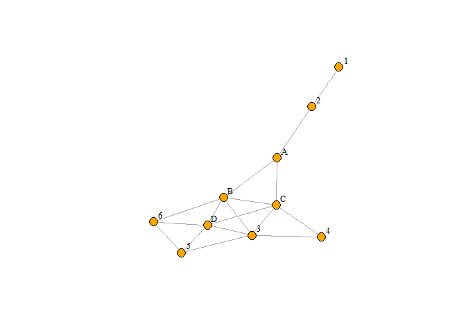
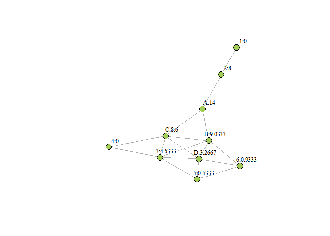
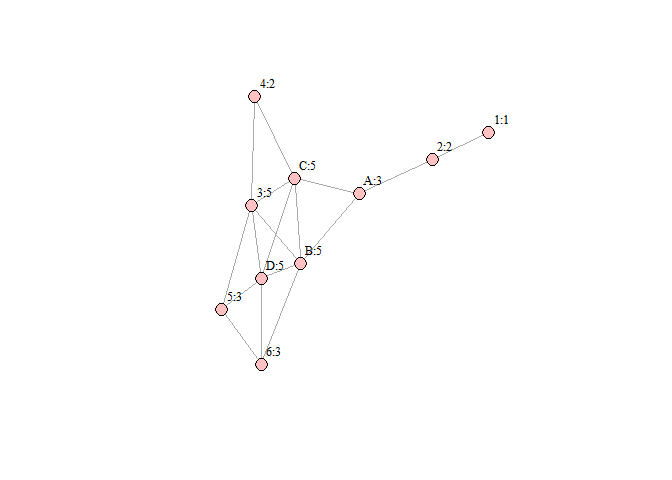
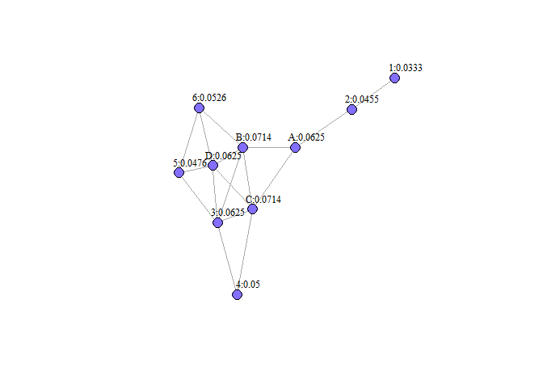

Exercise_2
================
Diwei_Zhu

``` r
library(readr)
library(igraph)
```

    ## Warning: package 'igraph' was built under R version 4.1.3

    ## 
    ## Attaching package: 'igraph'

    ## The following objects are masked from 'package:stats':
    ## 
    ##     decompose, spectrum

    ## The following object is masked from 'package:base':
    ## 
    ##     union

``` r
library(ggraph)
```

    ## Warning: package 'ggraph' was built under R version 4.1.3

    ## Loading required package: ggplot2

## Create edge list

create the edges data frame and plot a undirected graph.

``` r
from_ <- c("1","2","3","3","3","3","3","4","5","5","6","6","D","D","B","B","A")
to_ <- c("2","A","D","C","B","4","5","C","D","6","D","B","B","C","C","A","C")

egde <- data.frame(from = from_, to=to_)
g <- graph_from_data_frame(egde, directed=FALSE)
g
```

    ## IGRAPH 14f3754 UN-- 10 17 -- 
    ## + attr: name (v/c)
    ## + edges from 14f3754 (vertex names):
    ##  [1] 1--2 2--A 3--D 3--C 3--B 3--4 3--5 4--C 5--D 5--6 6--D 6--B D--B D--C B--C
    ## [16] B--A A--C

Plot the network with seat label next to each node.

``` r
plot(g, layout=layout.fruchterman.reingold,
    vertex.size = 10,
    vertex.label = V(g)$name, # Set the labels (Node)
    vertex.label.cex = 0.8,   # Slightly smaller font
    vertex.label.dist = 1.5,  # Offset the labels
    vertex.label.color = "black",
    vertex.color = "orange")
```

<!-- -->

## Betweenness Centrality

Calculate betweenness centrality and display the values.

``` r
bc <- betweenness(g)
bc
```

    ##          1          2          3          4          5          6          D 
    ##  0.0000000  8.0000000  4.6333333  0.0000000  0.5333333  0.9333333  3.2666667 
    ##          B          A          C 
    ##  9.0333333 14.0000000  8.6000000

Plot the network graph with labels and betweenness centrality values.

``` r
V(g)$betweenness <- round(betweenness(g),4)
label1 <- paste(V(g)$name,V(g)$betweenness,sep=":")
  
plot(g, layout=layout.fruchterman.reingold,
    vertex.size = 10,          
    vertex.label = label1, # Set the labels (Node:betweenness)
    vertex.label.cex = 0.8,   
    vertex.label.dist = 2,  
    vertex.label.color = "black",
    vertex.color = "darkolivegreen3")
```

<!-- -->

## Degree Centrality

Calculate degree centrality and display the values.

``` r
dc <- degree(g)
dc
```

    ## 1 2 3 4 5 6 D B A C 
    ## 1 2 5 2 3 3 5 5 3 5

Plot the network graph with labels and degree centrality values.

``` r
V(g)$degree <- degree(g)
label2 <- paste(V(g)$name,V(g)$degree,sep=":")
  
plot(g, layout=layout.fruchterman.reingold,
    vertex.size = 10,          
    vertex.label = label2, # Set the labels (Node:degree)
    vertex.label.cex = 0.8,   
    vertex.label.dist = 2,  
    vertex.label.color = "black",
    vertex.color = "rosybrown1")
```

<!-- -->

## Closeness Centrality

Calculate closeness centrality and display the values.

``` r
cc <- closeness(g)
cc
```

    ##          1          2          3          4          5          6          D 
    ## 0.03333333 0.04545455 0.06250000 0.05000000 0.04761905 0.05263158 0.06250000 
    ##          B          A          C 
    ## 0.07142857 0.06250000 0.07142857

Plot the network graph with labels and closeness centrality values.

``` r
V(g)$closeness <- round(closeness(g),4)
label3 <- paste(V(g)$name,V(g)$closeness,sep=":")
  
plot(g, layout=layout.fruchterman.reingold,
    vertex.size = 10,          
    vertex.label = label3, # Set the labels (Node:closeness)
    vertex.label.cex = 0.8,   
    vertex.label.dist = 2,  
    vertex.label.color = "black",
    vertex.color = "slateblue1")
```

<!-- -->

## Choice of seat

We will make decision based on the three measure of centrality we
calculated.

1.  Degree Centrality: B, C, and D have degree centrality equal to 5
    while A has a lower degree centrality at 3. This means that if we
    sit on B, C, or D, there would be more people we can directly talk
    to.
2.  Betweenness Centrality: A has an obviously higher betweenness
    centrality at 14, meaning that A is on most of the shortest paths
    between pairs of seats and has a influence on the flow of
    information in the bus. Among B, C, and D, B has the highest
    betweenness centrality value. However, it seems to be rare that the
    colleagues would pass on messages from seat to seat (sounds like
    what kids would do in the classroom).
3.  Closeness Centrality: The higher the closeness centrality, the
    shorter the sum of shortest paths from a node to other nodes, and
    the closer the node to other nodes. B and C have the same highest
    closeness centrality.

To sum up, I will choose B if the passengers mainly talk to people who
sit next to them, because seat B has the highest degree centrality and
closeness centrality, as well as the second highest betweenness
centrality. However, if passengers on the bus like to pass on messages
from one to another even though the receiver is sitting next to the one
who sent the message, I will choose seat A to capture more information.
