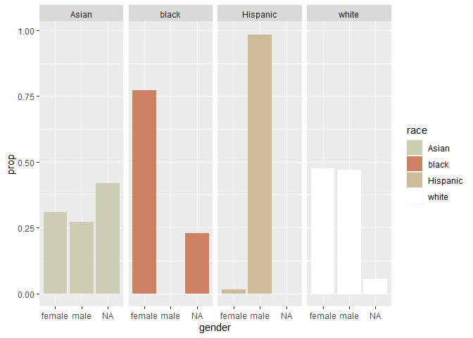
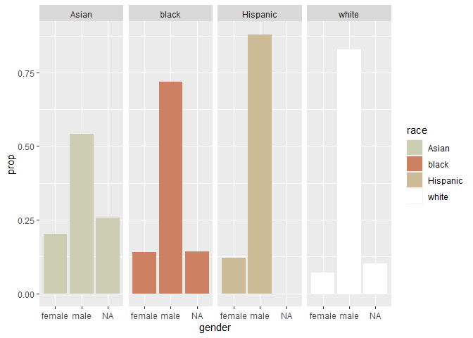
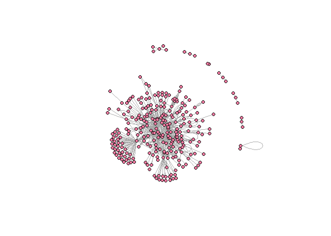
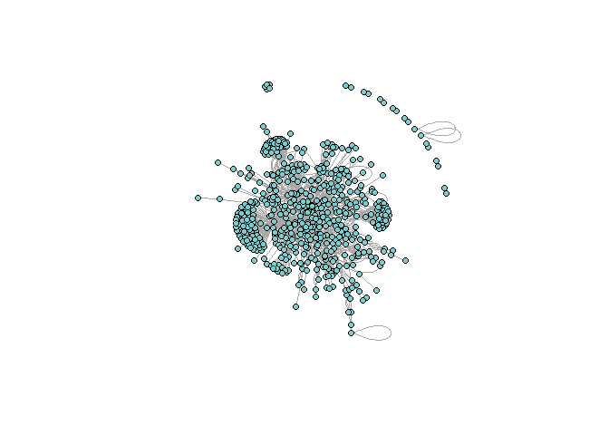

HW3
================
Diwei Zhu
5/18/2022

``` r
knitr::opts_chunk$set(echo = TRUE)
library(tidyverse)
```

    ## Warning: package 'tidyverse' was built under R version 4.1.3

    ## -- Attaching packages --------------------------------------- tidyverse 1.3.1 --

    ## v ggplot2 3.3.5     v purrr   0.3.4
    ## v tibble  3.1.6     v dplyr   1.0.7
    ## v tidyr   1.1.4     v stringr 1.4.0
    ## v readr   2.1.1     v forcats 0.5.1

    ## -- Conflicts ------------------------------------------ tidyverse_conflicts() --
    ## x dplyr::filter() masks stats::filter()
    ## x dplyr::lag()    masks stats::lag()

``` r
library(lubridate)
```

    ## 
    ## Attaching package: 'lubridate'

    ## The following objects are masked from 'package:base':
    ## 
    ##     date, intersect, setdiff, union

``` r
library(arrow)
```

    ## Warning: package 'arrow' was built under R version 4.1.3

    ## 
    ## Attaching package: 'arrow'

    ## The following object is masked from 'package:lubridate':
    ## 
    ##     duration

    ## The following object is masked from 'package:utils':
    ## 
    ##     timestamp

``` r
library(readr)
library(gender)
```

    ## Warning: package 'gender' was built under R version 4.1.3

``` r
library(wru)
```

    ## Warning: package 'wru' was built under R version 4.1.3

``` r
library(lubridate)
library(ggplot2)
library(igraph)
```

    ## Warning: package 'igraph' was built under R version 4.1.3

    ## 
    ## Attaching package: 'igraph'

    ## The following objects are masked from 'package:lubridate':
    ## 
    ##     %--%, union

    ## The following objects are masked from 'package:dplyr':
    ## 
    ##     as_data_frame, groups, union

    ## The following objects are masked from 'package:purrr':
    ## 
    ##     compose, simplify

    ## The following object is masked from 'package:tidyr':
    ## 
    ##     crossing

    ## The following object is masked from 'package:tibble':
    ## 
    ##     as_data_frame

    ## The following objects are masked from 'package:stats':
    ## 
    ##     decompose, spectrum

    ## The following object is masked from 'package:base':
    ## 
    ##     union

``` r
library(ggraph)
```

    ## Warning: package 'ggraph' was built under R version 4.1.3

``` r
library(tidygraph)
```

    ## Warning: package 'tidygraph' was built under R version 4.1.3

    ## 
    ## Attaching package: 'tidygraph'

    ## The following object is masked from 'package:igraph':
    ## 
    ##     groups

    ## The following object is masked from 'package:stats':
    ## 
    ##     filter

### Load data

Load the following data: + applications from `app_data_sample.parquet` +
edges from `edges_sample.csv`

``` r
data_path <- "C:/Users/admin/Documents/R projects/2022-ona-assignments/"
applications <- read_parquet(paste0(data_path,"app_data_sample.parquet"))
edges <- read_csv(paste0(data_path,"edges_sample.csv"))
```

    ## Rows: 32906 Columns: 4
    ## -- Column specification --------------------------------------------------------
    ## Delimiter: ","
    ## chr  (1): application_number
    ## dbl  (2): ego_examiner_id, alter_examiner_id
    ## date (1): advice_date
    ## 
    ## i Use `spec()` to retrieve the full column specification for this data.
    ## i Specify the column types or set `show_col_types = FALSE` to quiet this message.

``` r
applications
```

    ## # A tibble: 2,018,477 x 16
    ##    application_number filing_date examiner_name_last examiner_name_first
    ##    <chr>              <date>      <chr>              <chr>              
    ##  1 08284457           2000-01-26  HOWARD             JACQUELINE         
    ##  2 08413193           2000-10-11  YILDIRIM           BEKIR              
    ##  3 08531853           2000-05-17  HAMILTON           CYNTHIA            
    ##  4 08637752           2001-07-20  MOSHER             MARY               
    ##  5 08682726           2000-04-10  BARR               MICHAEL            
    ##  6 08687412           2000-04-28  GRAY               LINDA              
    ##  7 08716371           2004-01-26  MCMILLIAN          KARA               
    ##  8 08765941           2000-06-23  FORD               VANESSA            
    ##  9 08776818           2000-02-04  STRZELECKA         TERESA             
    ## 10 08809677           2002-02-20  KIM                SUN                
    ## # ... with 2,018,467 more rows, and 12 more variables:
    ## #   examiner_name_middle <chr>, examiner_id <dbl>, examiner_art_unit <dbl>,
    ## #   uspc_class <chr>, uspc_subclass <chr>, patent_number <chr>,
    ## #   patent_issue_date <date>, abandon_date <date>, disposal_type <chr>,
    ## #   appl_status_code <dbl>, appl_status_date <chr>, tc <dbl>

``` r
edges
```

    ## # A tibble: 32,906 x 4
    ##    application_number advice_date ego_examiner_id alter_examiner_id
    ##    <chr>              <date>                <dbl>             <dbl>
    ##  1 09402488           2008-11-17            84356             66266
    ##  2 09402488           2008-11-17            84356             63519
    ##  3 09402488           2008-11-17            84356             98531
    ##  4 09445135           2008-08-21            92953             71313
    ##  5 09445135           2008-08-21            92953             93865
    ##  6 09445135           2008-08-21            92953             91818
    ##  7 09479304           2008-12-15            61767             69277
    ##  8 09479304           2008-12-15            61767             92446
    ##  9 09479304           2008-12-15            61767             66805
    ## 10 09479304           2008-12-15            61767             70919
    ## # ... with 32,896 more rows

## Question 1

### Get gender for examiners

We’ll get gender based on the first name of the examiner, which is
recorded in the field `examiner_name_first`. We’ll use library `gender`
for that, relying on a modified version of their own
[example](https://cran.r-project.org/web/packages/gender/vignettes/predicting-gender.html).

Note that there are over 2 million records in the applications table –
that’s because there are many records for each examiner, as many as the
number of applications that examiner worked on during this time frame.
Our first step therefore is to get all *unique* names in a separate list
`examiner_names`. We will then guess gender for each one and will join
this table back to the original dataset. So, let’s get names without
repetition:

``` r
# install_genderdata_package() # only run this line the first time you use the package, to get data for it

# get a list of first names without repetitions
examiner_names <- applications %>% 
  distinct(examiner_name_first)

examiner_names
```

    ## # A tibble: 2,595 x 1
    ##    examiner_name_first
    ##    <chr>              
    ##  1 JACQUELINE         
    ##  2 BEKIR              
    ##  3 CYNTHIA            
    ##  4 MARY               
    ##  5 MICHAEL            
    ##  6 LINDA              
    ##  7 KARA               
    ##  8 VANESSA            
    ##  9 TERESA             
    ## 10 SUN                
    ## # ... with 2,585 more rows

Now let’s use function `gender()` as shown in the example for the
package to attach a gender and probability to each name and put the
results into the table `examiner_names_gender`

``` r
# get a table of names and gender
examiner_names_gender <- examiner_names %>% 
  do(results = gender(.$examiner_name_first, method = "ssa")) %>% 
  unnest(cols = c(results), keep_empty = TRUE) %>% 
  select(
    examiner_name_first = name,
    gender,
    proportion_female
  )

examiner_names_gender
```

    ## # A tibble: 1,822 x 3
    ##    examiner_name_first gender proportion_female
    ##    <chr>               <chr>              <dbl>
    ##  1 AARON               male              0.0082
    ##  2 ABDEL               male              0     
    ##  3 ABDOU               male              0     
    ##  4 ABDUL               male              0     
    ##  5 ABDULHAKIM          male              0     
    ##  6 ABDULLAH            male              0     
    ##  7 ABDULLAHI           male              0     
    ##  8 ABIGAIL             female            0.998 
    ##  9 ABIMBOLA            female            0.944 
    ## 10 ABRAHAM             male              0.0031
    ## # ... with 1,812 more rows

Finally, let’s join that table back to our original applications data
and discard the temporary tables we have just created to reduce clutter
in our environment.

``` r
# remove extra colums from the gender table
examiner_names_gender <- examiner_names_gender %>% 
  select(examiner_name_first, gender)

# joining gender back to the dataset
applications <- applications %>% 
  left_join(examiner_names_gender, by = "examiner_name_first")

# cleaning up
rm(examiner_names)
rm(examiner_names_gender)
gc()
```

    ##            used  (Mb) gc trigger  (Mb) max used  (Mb)
    ## Ncells  4746443 253.5    8313131 444.0  5170566 276.2
    ## Vcells 49945582 381.1   93177515 710.9 80261258 612.4

### Guess the examiner’s race

We’ll now use package `wru` to estimate likely race of an examiner. Just
like with gender, we’ll get a list of unique names first, only now we
are using surnames.

``` r
examiner_surnames <- applications %>% 
  select(surname = examiner_name_last) %>% 
  distinct()

examiner_surnames
```

    ## # A tibble: 3,806 x 1
    ##    surname   
    ##    <chr>     
    ##  1 HOWARD    
    ##  2 YILDIRIM  
    ##  3 HAMILTON  
    ##  4 MOSHER    
    ##  5 BARR      
    ##  6 GRAY      
    ##  7 MCMILLIAN 
    ##  8 FORD      
    ##  9 STRZELECKA
    ## 10 KIM       
    ## # ... with 3,796 more rows

We’ll follow the instructions for the package outlined here
<https://github.com/kosukeimai/wru>.

``` r
examiner_race <- predict_race(voter.file = examiner_surnames, surname.only = T) %>% 
  as_tibble()
```

    ## [1] "Proceeding with surname-only predictions..."

    ## Warning in merge_surnames(voter.file): Probabilities were imputed for 698
    ## surnames that could not be matched to Census list.

``` r
examiner_race
```

    ## # A tibble: 3,806 x 6
    ##    surname    pred.whi pred.bla pred.his pred.asi pred.oth
    ##    <chr>         <dbl>    <dbl>    <dbl>    <dbl>    <dbl>
    ##  1 HOWARD       0.643   0.295    0.0237   0.005     0.0333
    ##  2 YILDIRIM     0.861   0.0271   0.0609   0.0135    0.0372
    ##  3 HAMILTON     0.702   0.237    0.0245   0.0054    0.0309
    ##  4 MOSHER       0.947   0.00410  0.0241   0.00640   0.0185
    ##  5 BARR         0.827   0.117    0.0226   0.00590   0.0271
    ##  6 GRAY         0.687   0.251    0.0241   0.0054    0.0324
    ##  7 MCMILLIAN    0.359   0.574    0.0189   0.00260   0.0463
    ##  8 FORD         0.620   0.32     0.0237   0.0045    0.0313
    ##  9 STRZELECKA   0.666   0.0853   0.137    0.0797    0.0318
    ## 10 KIM          0.0252  0.00390  0.00650  0.945     0.0198
    ## # ... with 3,796 more rows

As you can see, we get probabilities across five broad US Census
categories: white, black, Hispanic, Asian and other. (Some of you may
correctly point out that Hispanic is not a race category in the US
Census, but these are the limitations of this package.)

Our final step here is to pick the race category that has the highest
probability for each last name and then join the table back to the main
applications table. See this example for comparing values across
columns: <https://www.tidyverse.org/blog/2020/04/dplyr-1-0-0-rowwise/>.
And this one for `case_when()` function:
<https://dplyr.tidyverse.org/reference/case_when.html>.

``` r
examiner_race <- examiner_race %>% 
  mutate(max_race_p = pmax(pred.asi, pred.bla, pred.his, pred.oth, pred.whi)) %>% 
  mutate(race = case_when(
    max_race_p == pred.asi ~ "Asian",
    max_race_p == pred.bla ~ "black",
    max_race_p == pred.his ~ "Hispanic",
    max_race_p == pred.oth ~ "other",
    max_race_p == pred.whi ~ "white",
    TRUE ~ NA_character_
  ))

examiner_race
```

    ## # A tibble: 3,806 x 8
    ##    surname    pred.whi pred.bla pred.his pred.asi pred.oth max_race_p race 
    ##    <chr>         <dbl>    <dbl>    <dbl>    <dbl>    <dbl>      <dbl> <chr>
    ##  1 HOWARD       0.643   0.295    0.0237   0.005     0.0333      0.643 white
    ##  2 YILDIRIM     0.861   0.0271   0.0609   0.0135    0.0372      0.861 white
    ##  3 HAMILTON     0.702   0.237    0.0245   0.0054    0.0309      0.702 white
    ##  4 MOSHER       0.947   0.00410  0.0241   0.00640   0.0185      0.947 white
    ##  5 BARR         0.827   0.117    0.0226   0.00590   0.0271      0.827 white
    ##  6 GRAY         0.687   0.251    0.0241   0.0054    0.0324      0.687 white
    ##  7 MCMILLIAN    0.359   0.574    0.0189   0.00260   0.0463      0.574 black
    ##  8 FORD         0.620   0.32     0.0237   0.0045    0.0313      0.620 white
    ##  9 STRZELECKA   0.666   0.0853   0.137    0.0797    0.0318      0.666 white
    ## 10 KIM          0.0252  0.00390  0.00650  0.945     0.0198      0.945 Asian
    ## # ... with 3,796 more rows

Let’s join the data back to the applications table.

``` r
# removing extra columns
examiner_race <- examiner_race %>% 
  select(surname,race)

applications <- applications %>% 
  left_join(examiner_race, by = c("examiner_name_last" = "surname"))

rm(examiner_race)
rm(examiner_surnames)
gc()
```

    ##            used  (Mb) gc trigger  (Mb) max used  (Mb)
    ## Ncells  5085674 271.7    8313131 444.0  6100274 325.8
    ## Vcells 53630311 409.2   93177515 710.9 92625131 706.7

## Examiner’s tenure

To figure out the timespan for which we observe each examiner in the
applications data, let’s find the first and the last observed date for
each examiner. We’ll first get examiner IDs and application dates in a
separate table, for ease of manipulation. We’ll keep examiner ID (the
field `examiner_id`), and earliest and latest dates for each application
(`filing_date` and `appl_status_date` respectively). We’ll use functions
in package `lubridate` to work with date and time values.

``` r
examiner_dates <- applications %>% 
  select(examiner_id, filing_date, appl_status_date) 

examiner_dates
```

    ## # A tibble: 2,018,477 x 3
    ##    examiner_id filing_date appl_status_date  
    ##          <dbl> <date>      <chr>             
    ##  1       96082 2000-01-26  30jan2003 00:00:00
    ##  2       87678 2000-10-11  27sep2010 00:00:00
    ##  3       63213 2000-05-17  30mar2009 00:00:00
    ##  4       73788 2001-07-20  07sep2009 00:00:00
    ##  5       77294 2000-04-10  19apr2001 00:00:00
    ##  6       68606 2000-04-28  16jul2001 00:00:00
    ##  7       89557 2004-01-26  15may2017 00:00:00
    ##  8       97543 2000-06-23  03apr2002 00:00:00
    ##  9       98714 2000-02-04  27nov2002 00:00:00
    ## 10       65530 2002-02-20  23mar2009 00:00:00
    ## # ... with 2,018,467 more rows

The dates look inconsistent in terms of formatting. Let’s make them
consistent. We’ll create new variables `start_date` and `end_date`.

``` r
examiner_dates <- examiner_dates %>% 
  mutate(start_date = ymd(filing_date), end_date = as_date(dmy_hms(appl_status_date)))
```

Let’s now identify the earliest and the latest date for each examiner
and calculate the difference in days, which is their tenure in the
organization.

``` r
examiner_dates <- examiner_dates %>% 
  group_by(examiner_id) %>% 
  summarise(
    earliest_date = min(start_date, na.rm = TRUE), 
    latest_date = max(end_date, na.rm = TRUE),
    tenure_days = interval(earliest_date, latest_date) %/% days(1)
    ) %>% 
  filter(year(latest_date)<2018)

examiner_dates
```

    ## # A tibble: 5,625 x 4
    ##    examiner_id earliest_date latest_date tenure_days
    ##          <dbl> <date>        <date>            <dbl>
    ##  1       59012 2004-07-28    2015-07-24         4013
    ##  2       59025 2009-10-26    2017-05-18         2761
    ##  3       59030 2005-12-12    2017-05-22         4179
    ##  4       59040 2007-09-11    2017-05-23         3542
    ##  5       59052 2001-08-21    2007-02-28         2017
    ##  6       59054 2000-11-10    2016-12-23         5887
    ##  7       59055 2004-11-02    2007-12-26         1149
    ##  8       59056 2000-03-24    2017-05-22         6268
    ##  9       59074 2000-01-31    2017-03-17         6255
    ## 10       59081 2011-04-21    2017-05-19         2220
    ## # ... with 5,615 more rows

Joining back to the applications data.

``` r
applications <- applications %>% 
  left_join(examiner_dates, by = "examiner_id")

rm(examiner_dates)
gc()
```

    ##            used  (Mb) gc trigger   (Mb)  max used   (Mb)
    ## Ncells  5099412 272.4   15030703  802.8  15030703  802.8
    ## Vcells 66008495 503.7  134351621 1025.1 134239916 1024.2

## Question2

``` r
# we pick work group 163 and 172

w164 <- subset(applications, grepl("^164", applications$examiner_art_unit))
w164$gender <- factor(w164$gender)
w164$race <- factor(w164$race)
w241 <- subset(applications, grepl("^241", applications$examiner_art_unit))
w241$gender <- factor(w241$gender)
w241$race <- factor(w241$race)

# summary for group 164
summary(w164$gender)
```

    ## female   male   NA's 
    ##  41398  38393  13551

``` r
summary(w164$race)
```

    ##    Asian    black Hispanic    white 
    ##    21651     3899     1117    66675

``` r
summary(w164$tenure_days)
```

    ##    Min. 1st Qu.  Median    Mean 3rd Qu.    Max.    NA's 
    ##     314    6074    6315    6128    6338    6350    1884

``` r
# summry for group 241
summary(w241$gender)
```

    ## female   male   NA's 
    ##   2781  13256   3554

``` r
summary(w241$race)
```

    ##    Asian    black Hispanic    white 
    ##    10117      848      381     8245

``` r
summary(w241$tenure_days)
```

    ##    Min. 1st Qu.  Median    Mean 3rd Qu.    Max.    NA's 
    ##     548    4147    5257    4688    5911    6335      75

Race and gender distribution for work group 164 and 241 respectively

``` r
# merge 
w164$workgroup <- c('164')
w241$workgroup <- c('241')

merged = union(x = w164,y = w241)
```

Gender distribution in races for work group 164

``` r
toPlot<-w164%>%
  group_by(gender, race)%>%
  summarise(n = n())%>%
  group_by(race)%>%
  mutate(prop = n/sum(n))
```

    ## `summarise()` has grouped output by 'gender'. You can override using the
    ## `.groups` argument.

``` r
ggplot(data = toPlot, aes(gender, prop, fill = race)) + 
  geom_col() + 
  facet_grid(~race)+
  scale_fill_manual(values = c("lightyellow3","lightsalmon3", "wheat3","white"))
```

<!-- -->

Gender distribution in races for work group 241

``` r
toPlot<-w241 %>%
  group_by(gender, race)%>%
  summarise(n = n())%>%
  group_by(race)%>%
  mutate(prop = n/sum(n))
```

    ## `summarise()` has grouped output by 'gender'. You can override using the
    ## `.groups` argument.

``` r
ggplot(data = toPlot, aes(gender, prop, fill = race)) + 
  geom_col() + 
  facet_grid(~race)+
  scale_fill_manual(values = c("lightyellow3","lightsalmon3", "wheat3","white"))
```

<!-- -->

## Question 3

Create node lists for eacch work group

``` r
# join selected work groups with edges list
edges <- drop_na(edges, ego_examiner_id)
edges <-drop_na(edges, alter_examiner_id)
w164_2 <- inner_join(w164, edges, by = "application_number", copy = FALSE) 
w241_2 <- inner_join(w241, edges, by = "application_number", copy = FALSE) 

# nodes dataframe of work groups and merge them
w164_nodes1 <- w164_2 %>% 
  distinct(ego_examiner_id) %>%
  rename(ID = ego_examiner_id)

w164_nodes2 <- w164_2 %>% 
  distinct(alter_examiner_id) %>%
  rename(ID = alter_examiner_id)

w241_nodes1 <- w241_2 %>% 
  distinct(ego_examiner_id) %>%
  rename(ID = ego_examiner_id)

w241_nodes2 <- w241_2 %>% 
  distinct(alter_examiner_id) %>%
  rename(ID = alter_examiner_id)

# merge the two dataframes for each work goup
w164_nodes <- union_all(w164_nodes1, w164_nodes2)
w241_nodes <- union_all(w241_nodes1, w241_nodes2)

w164_nodes <- unique(w164_nodes)
w241_nodes <- unique(w241_nodes)

head(w164_nodes, 5)
```

    ## # A tibble: 5 x 1
    ##      ID
    ##   <dbl>
    ## 1 91688
    ## 2 97910
    ## 3 75775
    ## 4 70204
    ## 5 71120

Create final edge list

``` r
w164_edges <- w164_2 %>% 
  select(ego_examiner_id, alter_examiner_id)

w241_edges <- w241_2 %>% 
  select(ego_examiner_id, alter_examiner_id)

head(w164_edges, 5)
```

    ## # A tibble: 5 x 2
    ##   ego_examiner_id alter_examiner_id
    ##             <dbl>             <dbl>
    ## 1           91688             71059
    ## 2           91688             67669
    ## 3           97910             59738
    ## 4           97910             99004
    ## 5           97910             67669

``` r
g_w164 <- graph_from_data_frame(w164_edges, directed=FALSE)
g_w241 <- graph_from_data_frame(w241_edges, directed=FALSE)
```

Plot vertex graph for work group 164

``` r
plot(g_w164, layout=layout.fruchterman.reingold,
    vertex.size = 5,
    vertex.label = NA,
    vertex.color = "palevioletred2")
```

<!-- -->

Plot vertex graph for work group 241

``` r
plot(g_w241, layout=layout.fruchterman.reingold,
    vertex.size = 5,
    vertex.label = NA,
    vertex.color = "darkslategray3")
```

<!-- --> Calculate
centralities

``` r
# betweenness
bc_w164 <- sort(betweenness(g_w164), decreasing = TRUE)
bc_w241 <- sort(betweenness(g_w241), decreasing = TRUE)

# degree
dg_w164 <- sort(degree(g_w164), decreasing = TRUE)
dg_w241 <- sort(degree(g_w241), decreasing = TRUE)

# closeness
cc_w164 <- sort(closeness(g_w164), decreasing = TRUE)
cc_w241 <- sort(closeness(g_w241), decreasing = TRUE)

print("top 5 of betwenness centrality for work group 164")
```

    ## [1] "top 5 of betwenness centrality for work group 164"

``` r
print(head(bc_w164,5))
```

    ##     72882     87897     97910     66266     73260 
    ## 12338.868  9951.339  6984.072  4250.095  3709.533

``` r
print("top 5 of betwenness centrality for work group 241")
```

    ## [1] "top 5 of betwenness centrality for work group 241"

``` r
print(head(bc_w241,5))
```

    ##    62919    62038    91499    95183    61485 
    ## 67440.85 21071.27 16727.50 15711.58 15142.94

``` r
print("top 5 of degree centrality for work group 164")
```

    ## [1] "top 5 of degree centrality for work group 164"

``` r
print(head(dg_w164,5))
```

    ## 97910 72882 87897 59738 99004 
    ##   170   154    96    83    82

``` r
print("top 5 of degree centrality for work group 241")
```

    ## [1] "top 5 of degree centrality for work group 241"

``` r
print(head(dg_w241,5))
```

    ## 62919 67226 92078 61485 71764 
    ##   178   175   132   101   100

``` r
print("top 5 of closeness centrality for work group 164")
```

    ## [1] "top 5 of closeness centrality for work group 164"

``` r
print(head(cc_w164,15))
```

    ##     97706     76749     75119     67435     84944     59658     80908     67013 
    ## 1.0000000 1.0000000 1.0000000 1.0000000 0.5000000 0.5000000 0.5000000 0.5000000 
    ##     97072     86403     68637     97834     95085     62142     70907 
    ## 0.3333333 0.3333333 0.3333333 0.3333333 0.3333333 0.3333333 0.3333333

``` r
print("top 5 of closeness centrality for work group 241")
```

    ## [1] "top 5 of closeness centrality for work group 241"

``` r
print(head(cc_w241,15))
```

    ## 91652 93841 66060 97883 63765 72734 70399 61007 66905 96538 64053 97508 75981 
    ##     1     1     1     1     1     1     1     1     1     1     1     1     1 
    ## 63155 72089 
    ##     1     1

### Pick measures of centrality

I would pick betweenness centrality and degree centrality from the three
centralities I calculated above, because in the USPTO case: (1) how many
contacts does one examiner have (degree centrality) is a useful
information, and (2) the transfer of information among all examiners are
important, making the examiner who on the shortest paths between other
examiners more important. Additionally, because for work group 241,
there are many examiners who are of the highest closeness centrality,
the advantage of having the highest closeness centrality is not very
strong in my specific case.
