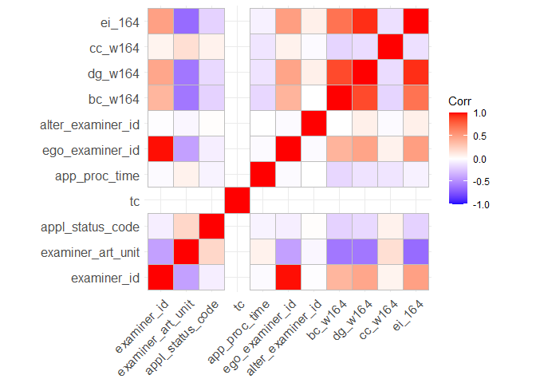
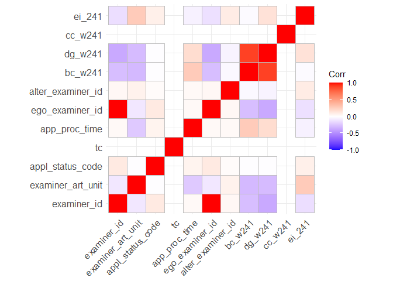

HW4
================
Diwei Zhu
5/25/2022

### 1. Load data, get gender, and create `app_proc_time` column

### Load data

``` r
data_path <- "C:/Users/admin/Documents/R projects/2022-ona-assignments/"
applications <- read_parquet(paste0(data_path,"app_data_sample.parquet"))
edges <- read_csv(paste0(data_path,"edges_sample.csv"))
```

    ## Rows: 32906 Columns: 4
    ## -- Column specification --------------------------------------------------------
    ## Delimiter: ","
    ## chr  (1): application_number
    ## dbl  (2): ego_examiner_id, alter_examiner_id
    ## date (1): advice_date
    ## 
    ## i Use `spec()` to retrieve the full column specification for this data.
    ## i Specify the column types or set `show_col_types = FALSE` to quiet this message.

``` r
applications
```

    ## # A tibble: 2,018,477 x 16
    ##    application_number filing_date examiner_name_last examiner_name_first
    ##    <chr>              <date>      <chr>              <chr>              
    ##  1 08284457           2000-01-26  HOWARD             JACQUELINE         
    ##  2 08413193           2000-10-11  YILDIRIM           BEKIR              
    ##  3 08531853           2000-05-17  HAMILTON           CYNTHIA            
    ##  4 08637752           2001-07-20  MOSHER             MARY               
    ##  5 08682726           2000-04-10  BARR               MICHAEL            
    ##  6 08687412           2000-04-28  GRAY               LINDA              
    ##  7 08716371           2004-01-26  MCMILLIAN          KARA               
    ##  8 08765941           2000-06-23  FORD               VANESSA            
    ##  9 08776818           2000-02-04  STRZELECKA         TERESA             
    ## 10 08809677           2002-02-20  KIM                SUN                
    ## # ... with 2,018,467 more rows, and 12 more variables:
    ## #   examiner_name_middle <chr>, examiner_id <dbl>, examiner_art_unit <dbl>,
    ## #   uspc_class <chr>, uspc_subclass <chr>, patent_number <chr>,
    ## #   patent_issue_date <date>, abandon_date <date>, disposal_type <chr>,
    ## #   appl_status_code <dbl>, appl_status_date <chr>, tc <dbl>

``` r
edges
```

    ## # A tibble: 32,906 x 4
    ##    application_number advice_date ego_examiner_id alter_examiner_id
    ##    <chr>              <date>                <dbl>             <dbl>
    ##  1 09402488           2008-11-17            84356             66266
    ##  2 09402488           2008-11-17            84356             63519
    ##  3 09402488           2008-11-17            84356             98531
    ##  4 09445135           2008-08-21            92953             71313
    ##  5 09445135           2008-08-21            92953             93865
    ##  6 09445135           2008-08-21            92953             91818
    ##  7 09479304           2008-12-15            61767             69277
    ##  8 09479304           2008-12-15            61767             92446
    ##  9 09479304           2008-12-15            61767             66805
    ## 10 09479304           2008-12-15            61767             70919
    ## # ... with 32,896 more rows

### Get gender for examiners

``` r
# get examiner names
examiner_names <- applications %>% 
  distinct(examiner_name_first)

# get gender from their names
examiner_names_gender <- examiner_names %>% 
  do(results = gender(.$examiner_name_first, method = "ssa")) %>% 
  unnest(cols = c(results), keep_empty = TRUE) %>% 
  select(
    examiner_name_first = name,
    gender,
    proportion_female
  )

# remove extra columns from the gender table
examiner_names_gender <- examiner_names_gender %>% 
  select(examiner_name_first, gender)

# joining gender back to the dataset
applications <- applications %>% 
  left_join(examiner_names_gender, by = "examiner_name_first")

# cleaning up
rm(examiner_names)
rm(examiner_names_gender)
gc()
```

    ##            used  (Mb) gc trigger  (Mb) max used  (Mb)
    ## Ncells  5981796 319.5   10328058 551.6  6301007 336.6
    ## Vcells 51972691 396.6  100800544 769.1 82288347 627.9

### Get end dates (patent issue date or patent abandon date)

``` r
applications <- applications %>% 
  mutate(patent_issue_date = coalesce(patent_issue_date, abandon_date))

names(applications)[11] <- "end_date"
```

### Drop na based on end_date, gender, and filing_date

``` r
applications <- drop_na(applications, end_date)
applications <- drop_na(applications, gender)
applications <- drop_na(applications, filing_date)
```

### Change end_date and filing_date to Date-Time data type, then calculate the application processing time as days

``` r
applications$filing_date <- strptime(as.Date(applications$filing_date), "%Y-%m-%d")
applications$end_date <- strptime(as.Date(applications$end_date), "%Y-%m-%d")

applications$app_proc_time0 <- as.Date(applications$end_date) - as.Date(applications$filing_date)
```

### We noticed that there are negative time difference, which, needed to be removed.

``` r
# index of rows that need to be dropped
to_drop <- c()

# create "0 day time difference" value
zeroday <- 0
zeroday1 <- as.difftime(zeroday, units = "days")

for (i in c(1: nrow(applications))) {
  if (applications$app_proc_time0[i] < zeroday1) {
    to_drop = c(to_drop, i)
  }
}

# drop selected rows
applications <- applications[-to_drop, ]
```

### Create the numeric `app_proc_time` column

``` r
applications$app_proc_time <- as.numeric(applications$app_proc_time0, units="days")
```

Now that we have the clean `app_proc_time` column that can be used in
following steps.

## 2. Prepare edges list and calculate centralities

### Choose work group 164 and 241

``` r
w164 <- subset(applications, grepl("^164", applications$examiner_art_unit))
w164$gender <- factor(w164$gender)
w241 <- subset(applications, grepl("^241", applications$examiner_art_unit))
w241$gender <- factor(w241$gender)
```

### Pre-process egdes list

``` r
edges <- drop_na(edges, ego_examiner_id)
edges <-drop_na(edges, alter_examiner_id)

# join eges to the work group dataset by application number
w164_edges <- inner_join(w164, edges, by = "application_number", copy = FALSE) 
w241_edges <- inner_join(w241, edges, by = "application_number", copy = FALSE)

# fix the problem where examiner_id not equal to both ego and alter examiner id
to_drop0 <- c()
to_drop1 <- c()

for (i in c(1: nrow(w164_edges))) {
  if ((w164_edges$examiner_id[i] != w164_edges$ego_examiner_id[i])&(w164_edges$examiner_id[i] != w164_edges$alter_examiner_id[i])) {
    to_drop0 = c(to_drop0, i)
  }
}
for (i in c(1: nrow(w241_edges))) {
  if ((w241_edges$examiner_id[i] != w241_edges$ego_examiner_id[i])&(w241_edges$examiner_id[i] != w241_edges$alter_examiner_id[i])) {
    to_drop1 = c(to_drop1, i)
  }
}
# drop selected rows
w164_edges <- w164_edges[-to_drop0, ]
w241_edges <- w241_edges[-to_drop1, ]
```

### Create nodes list

``` r
# nodes dataframe of work groups and merge them
w164_nodes_ego <- w164_edges %>% 
  distinct(ego_examiner_id) %>%
  rename(examiner_id = ego_examiner_id)

w164_nodes_alter <- w164_edges %>% 
  distinct(alter_examiner_id) %>%
  rename(examiner_id = alter_examiner_id)

w241_nodes_ego <- w241_edges %>% 
  distinct(ego_examiner_id) %>%
  rename(examiner_id = ego_examiner_id)

w241_nodes_alter <- w241_edges %>% 
  distinct(alter_examiner_id) %>%
  rename(examiner_id = alter_examiner_id)

# merge the two dataframes for each work goup
w164_nodes <- union_all(w164_nodes_ego, w164_nodes_alter)
w241_nodes <- union_all(w241_nodes_ego, w241_nodes_alter)

w164_nodes <- unique(w164_nodes)
w241_nodes <- unique(w241_nodes)

head(w164_nodes, 5)
```

    ## # A tibble: 5 x 1
    ##   examiner_id
    ##         <dbl>
    ## 1       97910
    ## 2       59338
    ## 3       96963
    ## 4       93839
    ## 5       74224

### Create edge list for centrality calculation

``` r
w164_edges_f <- w164_edges %>% 
  select(ego_examiner_id, alter_examiner_id)

w241_edges_f <- w241_edges %>% 
  select(ego_examiner_id, alter_examiner_id)

head(w164_edges_f, 5)
```

    ## # A tibble: 5 x 2
    ##   ego_examiner_id alter_examiner_id
    ##             <dbl>             <dbl>
    ## 1           97910             59738
    ## 2           97910             99004
    ## 3           97910             67669
    ## 4           59338             72882
    ## 5           96963             72882

### Create graph then calculate centralities

``` r
g_w164 <- graph_from_data_frame(w164_edges_f, directed=FALSE)
g_w241 <- graph_from_data_frame(w241_edges_f, directed=FALSE)

# betweenness
bc_w164 <- betweenness(g_w164)
bc_w241 <- betweenness(g_w241)

# degree
dg_w164 <- degree(g_w164)
dg_w241 <- degree(g_w241)

# closeness
cc_w164 <- closeness(g_w164)
cc_w241 <- closeness(g_w241)

# eigen vector
ei_164 <- eigen_centrality(g_w164)$vector
ei_241 <- eigen_centrality(g_w241)$vector
```

### Put calculated centralities into a dataframe and then concatenate side-by-side with nodes dataframe

``` r
centralities_164 <- cbind(bc_w164, dg_w164, cc_w164, ei_164)
centralities_241 <- cbind(bc_w241, dg_w241, cc_w241, ei_241)

centralities_df_164 <- cbind(w164_nodes, centralities_164)
centralities_df_241 <- cbind(w241_nodes, centralities_241)

head(centralities_df_164, 5)
```

    ##       examiner_id   bc_w164 dg_w164     cc_w164      ei_164
    ## 97910       97910 5683.0626     170 0.002252252 1.000000000
    ## 59338       59338  975.7403      17 0.001788909 0.017282388
    ## 96963       96963  654.9904      21 0.001934236 0.022424096
    ## 93839       93839  524.1371      33 0.001814882 0.022775645
    ## 74224       74224  582.0738      62 0.001669449 0.006464481

### Join the centralities and to the main dataset by examiner ID

``` r
processed_164 <- inner_join(w164_edges, centralities_df_164, by = "examiner_id", copy = FALSE)
processed_241 <- inner_join(w241_edges, centralities_df_241, by = "examiner_id", copy = FALSE)
head(processed_164, 5)
```

    ## # A tibble: 5 x 26
    ##   application_number filing_date         examiner_name_last examiner_name_first
    ##   <chr>              <dttm>              <chr>              <chr>              
    ## 1 09582808           2000-10-16 00:00:00 COUNTS             GARY               
    ## 2 09582808           2000-10-16 00:00:00 COUNTS             GARY               
    ## 3 09582808           2000-10-16 00:00:00 COUNTS             GARY               
    ## 4 09718803           2000-11-22 00:00:00 LI                 BAO                
    ## 5 09780035           2001-02-09 00:00:00 GAMBEL             PHILLIP            
    ## # ... with 22 more variables: examiner_name_middle <chr>, examiner_id <dbl>,
    ## #   examiner_art_unit <dbl>, uspc_class <chr>, uspc_subclass <chr>,
    ## #   patent_number <chr>, end_date <dttm>, abandon_date <date>,
    ## #   disposal_type <chr>, appl_status_code <dbl>, appl_status_date <chr>,
    ## #   tc <dbl>, gender <fct>, app_proc_time0 <drtn>, app_proc_time <dbl>,
    ## #   advice_date <date>, ego_examiner_id <dbl>, alter_examiner_id <dbl>,
    ## #   bc_w164 <dbl>, dg_w164 <dbl>, cc_w164 <dbl>, ei_164 <dbl>

## 3. Fit linear regression models for work group 164

### Correlation check

``` r
quantvars <- select_if(processed_164, is.numeric)

# populating correlation matrix
corr_matrix = cor(quantvars)
```

    ## Warning in cor(quantvars): the standard deviation is zero

``` r
corr_matrix <- round(corr_matrix, 2)

ggcorrplot(corr_matrix)
```

<!-- --> From the
correlation matrix we can see that the target variable `app_proc_time`
has no strong correlation with other numeric variables. The centralities
have strong correlation with each other.

### Drop unrelated predictors based on subjective judges, then change categorical predictors to factors

``` r
to_drop2 <- c("application_number","examiner_name_first","examiner_name_last","examiner_name_middle","filing_date", "end_date", "abandon_date", "app_proc_time0", "appl_status_date", "advice_date","tc","ego_examiner_id","alter_examiner_id","examiner_id","patent_number")
processed_164_f <- processed_164[ , !(names(processed_164) %in% to_drop2)]

# as.factor
processed_164_f$gender <- as.factor(processed_164_f$gender)
processed_164_f$disposal_type <- as.factor(processed_164_f$disposal_type)
processed_164_f$uspc_class <- as.factor(processed_164_f$uspc_class)
processed_164_f$uspc_subclass <- as.factor(processed_164_f$uspc_subclass)

# rename
names(processed_164_f)[8] <- "betweenness"
names(processed_164_f)[9] <- "degree"
names(processed_164_f)[10] <- "closeness"
names(processed_164_f)[11] <- "eigen"
```

### Random forest feature selection

``` r
cf1 <- cforest(app_proc_time ~ . , data= processed_164_f, control=cforest_unbiased(mtry=2,ntree=50))
rank1 <- sort(varimp(cf1), decreasing = TRUE)
rank1
```

    ##     uspc_subclass         closeness            gender            degree 
    ##         104995.39          45354.02          41536.24          35071.61 
    ##  appl_status_code       betweenness             eigen        uspc_class 
    ##          33656.84          31287.38          25993.73          21336.79 
    ## examiner_art_unit     disposal_type 
    ##          17506.49          16727.40

uspc_subclass is the strongest predictor, followed by the centralities
and gender.

### For work group 164, create models that (1) predictors are only the centralities, and (2) uspc_subclass is also a predictor

``` r
model_164a <- lm(app_proc_time ~ betweenness+degree+closeness+eigen, data=processed_164_f)
model_164b <- lm(app_proc_time ~ uspc_subclass+betweenness+degree+closeness+eigen, data=processed_164_f)
summary(model_164a)
```

    ## 
    ## Call:
    ## lm(formula = app_proc_time ~ betweenness + degree + closeness + 
    ##     eigen, data = processed_164_f)
    ## 
    ## Residuals:
    ##      Min       1Q   Median       3Q      Max 
    ## -1393.72  -435.34   -73.88   404.00  3133.00 
    ## 
    ## Coefficients:
    ##               Estimate Std. Error t value Pr(>|t|)    
    ## (Intercept) 1775.16912   43.75096  40.574  < 2e-16 ***
    ## betweenness   -0.04177    0.02028  -2.060   0.0397 *  
    ## degree        -2.97582    1.82944  -1.627   0.1042    
    ## closeness   -477.01063  116.28409  -4.102 4.51e-05 ***
    ## eigen        495.16465  204.05984   2.427   0.0155 *  
    ## ---
    ## Signif. codes:  0 '***' 0.001 '**' 0.01 '*' 0.05 '.' 0.1 ' ' 1
    ## 
    ## Residual standard error: 661.5 on 800 degrees of freedom
    ## Multiple R-squared:  0.05967,    Adjusted R-squared:  0.05497 
    ## F-statistic: 12.69 on 4 and 800 DF,  p-value: 5.094e-10

``` r
summary(model_164b)
```

    ## 
    ## Call:
    ## lm(formula = app_proc_time ~ uspc_subclass + betweenness + degree + 
    ##     closeness + eigen, data = processed_164_f)
    ## 
    ## Residuals:
    ##     Min      1Q  Median      3Q     Max 
    ## -1595.4  -330.5     0.0   243.7  2902.6 
    ## 
    ## Coefficients:
    ##                       Estimate Std. Error t value Pr(>|t|)    
    ## (Intercept)          2.142e+03  1.398e+02  15.321  < 2e-16 ***
    ## uspc_subclass003000  4.059e+02  6.248e+02   0.650 0.516098    
    ## uspc_subclass004000  1.415e+02  3.722e+02   0.380 0.703942    
    ## uspc_subclass005000 -6.299e+02  3.299e+02  -1.909 0.056623 .  
    ## uspc_subclass006000 -1.038e+02  1.664e+02  -0.624 0.533038    
    ## uspc_subclass007100 -3.415e+02  1.660e+02  -2.057 0.040091 *  
    ## uspc_subclass007200 -1.505e+02  1.970e+02  -0.764 0.445144    
    ## uspc_subclass007210 -1.335e+02  2.269e+02  -0.588 0.556564    
    ## uspc_subclass007230 -3.893e+02  2.031e+02  -1.917 0.055621 .  
    ## uspc_subclass007240  2.647e+02  3.291e+02   0.804 0.421614    
    ## uspc_subclass007400 -1.452e+03  6.150e+02  -2.361 0.018521 *  
    ## uspc_subclass007900 -1.296e+03  3.859e+02  -3.358 0.000829 ***
    ## uspc_subclass007920 -3.024e+02  2.510e+02  -1.205 0.228664    
    ## uspc_subclass007930 -7.005e+02  3.178e+02  -2.204 0.027838 *  
    ## uspc_subclass009000 -6.822e+02  4.462e+02  -1.529 0.126755    
    ## uspc_subclass009100  7.121e+02  4.612e+02   1.544 0.123006    
    ## uspc_subclass012000 -3.024e+02  1.686e+02  -1.793 0.073388 .  
    ## uspc_subclass015000 -3.456e+02  3.717e+02  -0.930 0.352821    
    ## uspc_subclass020000  3.523e+02  4.470e+02   0.788 0.430958    
    ## uspc_subclass023100 -4.335e+02  2.192e+02  -1.978 0.048355 *  
    ## uspc_subclass023200  1.600e+02  4.452e+02   0.359 0.719348    
    ## uspc_subclass023500 -2.610e+02  2.087e+02  -1.251 0.211414    
    ## uspc_subclass023530  1.851e+02  4.455e+02   0.416 0.677900    
    ## uspc_subclass040500  3.460e+02  4.460e+02   0.776 0.438121    
    ## uspc_subclass044000  1.014e+03  4.543e+02   2.232 0.025935 *  
    ## uspc_subclass058000  5.984e+02  6.265e+02   0.955 0.339874    
    ## uspc_subclass069100 -2.932e+02  1.677e+02  -1.748 0.080892 .  
    ## uspc_subclass069500 -3.338e+02  3.317e+02  -1.006 0.314536    
    ## uspc_subclass069600 -1.465e+03  6.146e+02  -2.383 0.017438 *  
    ## uspc_subclass069700 -5.678e+02  4.548e+02  -1.248 0.212299    
    ## uspc_subclass074000 -1.202e+03  3.859e+02  -3.114 0.001921 ** 
    ## uspc_subclass085100 -6.850e+02  3.125e+02  -2.192 0.028734 *  
    ## uspc_subclass085200 -5.772e+02  6.154e+02  -0.938 0.348591    
    ## uspc_subclass093100 -4.674e+02  3.005e+02  -1.555 0.120293    
    ## uspc_subclass093200 -8.794e+02  6.149e+02  -1.430 0.153151    
    ## uspc_subclass093700  6.075e+02  3.721e+02   1.633 0.103001    
    ## uspc_subclass100000 -3.658e+02  3.717e+02  -0.984 0.325326    
    ## uspc_subclass101000 -1.555e+03  3.859e+02  -4.029 6.23e-05 ***
    ## uspc_subclass120000 -7.318e+02  4.548e+02  -1.609 0.108072    
    ## uspc_subclass130100 -3.396e+02  2.145e+02  -1.583 0.113929    
    ## uspc_subclass131100  5.854e+02  6.151e+02   0.952 0.341545    
    ## uspc_subclass133100 -3.586e+02  1.616e+02  -2.218 0.026858 *  
    ## uspc_subclass138100 -7.313e+02  2.333e+02  -3.134 0.001798 ** 
    ## uspc_subclass139100 -1.019e+03  3.005e+02  -3.393 0.000732 ***
    ## uspc_subclass141100 -2.785e+02  4.451e+02  -0.626 0.531796    
    ## uspc_subclass142100  6.274e+02  4.457e+02   1.408 0.159685    
    ## uspc_subclass143100 -3.750e+02  2.800e+02  -1.339 0.180963    
    ## uspc_subclass144100  7.331e+02  4.450e+02   1.647 0.099949 .  
    ## uspc_subclass145100 -5.107e+02  2.419e+02  -2.112 0.035075 *  
    ## uspc_subclass146100 -5.610e+02  4.543e+02  -1.235 0.217239    
    ## uspc_subclass149100 -4.286e+02  4.455e+02  -0.962 0.336384    
    ## uspc_subclass153100 -1.486e+03  6.146e+02  -2.417 0.015897 *  
    ## uspc_subclass154100  8.541e+01  4.450e+02   0.192 0.847856    
    ## uspc_subclass155100 -1.031e+03  3.723e+02  -2.769 0.005769 ** 
    ## uspc_subclass157100 -1.479e+03  6.154e+02  -2.404 0.016493 *  
    ## uspc_subclass158100 -7.328e+02  3.834e+02  -1.911 0.056359 .  
    ## uspc_subclass164000  1.123e+02  3.859e+02   0.291 0.771016    
    ## uspc_subclass172000  3.825e+02  6.146e+02   0.622 0.533883    
    ## uspc_subclass173000 -5.382e+02  2.983e+02  -1.804 0.071690 .  
    ## uspc_subclass178100  3.970e+02  4.543e+02   0.874 0.382515    
    ## uspc_subclass183000 -8.846e+02  3.717e+02  -2.380 0.017586 *  
    ## uspc_subclass184100 -6.802e+02  3.025e+02  -2.249 0.024842 *  
    ## uspc_subclass185100 -5.873e+02  3.297e+02  -1.781 0.075302 .  
    ## uspc_subclass186100 -1.011e+03  6.152e+02  -1.643 0.100789    
    ## uspc_subclass188100 -5.306e+02  6.149e+02  -0.863 0.388531    
    ## uspc_subclass192100 -1.960e+02  4.452e+02  -0.440 0.659980    
    ## uspc_subclass198100  1.142e+02  4.548e+02   0.251 0.801816    
    ## uspc_subclass218100 -7.455e+02  4.460e+02  -1.672 0.095022 .  
    ## uspc_subclass224100 -1.104e+03  4.460e+02  -2.475 0.013564 *  
    ## uspc_subclass232100  1.419e+02  6.147e+02   0.231 0.817448    
    ## uspc_subclass234100  5.280e+02  6.147e+02   0.859 0.390631    
    ## uspc_subclass235100 -4.465e+02  4.453e+02  -1.003 0.316346    
    ## uspc_subclass236000 -1.156e+03  6.152e+02  -1.878 0.060780 .  
    ## uspc_subclass236100 -1.466e+02  3.719e+02  -0.394 0.693547    
    ## uspc_subclass239100 -1.636e+02  4.457e+02  -0.367 0.713692    
    ## uspc_subclass252300 -4.326e+02  4.458e+02  -0.970 0.332213    
    ## uspc_subclass254200  1.736e+02  4.453e+02   0.390 0.696692    
    ## uspc_subclass262100 -4.204e+02  4.453e+02  -0.944 0.345474    
    ## uspc_subclass278100  2.340e+02  3.717e+02   0.629 0.529242    
    ## uspc_subclass287200 -1.029e+03  2.039e+02  -5.047 5.76e-07 ***
    ## uspc_subclass300000 -9.547e+01  2.798e+02  -0.341 0.733018    
    ## uspc_subclass320100 -6.106e+02  6.149e+02  -0.993 0.321092    
    ## uspc_subclass324000 -3.752e+02  2.145e+02  -1.749 0.080733 .  
    ## uspc_subclass325000 -2.382e+02  3.291e+02  -0.724 0.469557    
    ## uspc_subclass335000 -7.053e+02  4.451e+02  -1.585 0.113502    
    ## uspc_subclass345000 -6.120e+02  4.459e+02  -1.372 0.170405    
    ## uspc_subclass346000 -1.402e+03  4.455e+02  -3.146 0.001724 ** 
    ## uspc_subclass350000 -2.747e+02  1.670e+02  -1.645 0.100470    
    ## uspc_subclass351000 -6.493e+02  3.480e+02  -1.866 0.062511 .  
    ## uspc_subclass377000 -3.919e+02  4.452e+02  -0.880 0.378942    
    ## uspc_subclass387100 -5.056e+02  1.912e+02  -2.645 0.008358 ** 
    ## uspc_subclass387300 -6.466e+02  2.798e+02  -2.311 0.021139 *  
    ## uspc_subclass387500 -6.699e+02  6.150e+02  -1.089 0.276436    
    ## uspc_subclass387900 -1.092e+02  2.676e+02  -0.408 0.683431    
    ## uspc_subclass388100 -6.119e+02  6.147e+02  -0.996 0.319826    
    ## uspc_subclass388220 -4.544e+01  3.717e+02  -0.122 0.902739    
    ## uspc_subclass388230 -6.298e+02  3.834e+02  -1.643 0.100880    
    ## uspc_subclass388300 -1.345e+03  3.720e+02  -3.615 0.000323 ***
    ## uspc_subclass388800 -7.673e+02  4.451e+02  -1.724 0.085163 .  
    ## uspc_subclass388850  9.471e+01  4.451e+02   0.213 0.831556    
    ## uspc_subclass388900  1.046e+03  3.834e+02   2.729 0.006516 ** 
    ## uspc_subclass389600 -8.433e+02  6.153e+02  -1.371 0.170934    
    ## uspc_subclass397000  2.208e+02  4.461e+02   0.495 0.620813    
    ## uspc_subclass400000 -7.372e+02  6.154e+02  -1.198 0.231387    
    ## uspc_subclass423000 -2.222e+02  4.473e+02  -0.497 0.619516    
    ## uspc_subclass449000  2.495e+02  6.147e+02   0.406 0.684977    
    ## uspc_subclass450000 -4.204e+02  6.149e+02  -0.684 0.494430    
    ## uspc_subclass510000  1.323e+02  3.859e+02   0.343 0.731707    
    ## uspc_subclass514000 -4.925e+02  3.308e+02  -1.489 0.137051    
    ## uspc_subclass515000 -4.007e+02  4.569e+02  -0.877 0.380862    
    ## uspc_subclass516000  9.743e+02  3.859e+02   2.525 0.011790 *  
    ## uspc_subclass518000 -1.392e+02  1.906e+02  -0.731 0.465330    
    ## uspc_subclass523000 -1.217e+03  3.178e+02  -3.829 0.000141 ***
    ## uspc_subclass525000 -8.833e+02  2.550e+02  -3.463 0.000567 ***
    ## uspc_subclass535000  9.312e+02  3.299e+02   2.822 0.004905 ** 
    ## uspc_subclass540000 -7.718e+02  3.734e+02  -2.067 0.039143 *  
    ## uspc_subclass754000 -3.061e+02  6.147e+02  -0.498 0.618721    
    ## uspc_subclass811000 -3.097e+02  2.550e+02  -1.214 0.225125    
    ## betweenness         -3.486e-02  2.632e-02  -1.324 0.185848    
    ## degree              -4.741e+00  2.280e+00  -2.079 0.037993 *  
    ## closeness           -5.897e+02  1.364e+02  -4.324 1.76e-05 ***
    ## eigen                7.589e+02  2.734e+02   2.776 0.005660 ** 
    ## ---
    ## Signif. codes:  0 '***' 0.001 '**' 0.01 '*' 0.05 '.' 0.1 ' ' 1
    ## 
    ## Residual standard error: 599.4 on 683 degrees of freedom
    ## Multiple R-squared:  0.3408, Adjusted R-squared:  0.2241 
    ## F-statistic: 2.919 on 121 and 683 DF,  p-value: < 2.2e-16

The R^2 of the first model is only 0.055. All of the centalities are
negatively related to the target variable. But the degree centrality is
not significant. With the subclass predictor, the R^2 of model 2
increased to 0.22.

## 4. Fit linear regression models for work group 241

### Correlation check

``` r
quantvars <- select_if(processed_241, is.numeric)

# populating correlation matrix
corr_matrix = cor(quantvars)
```

    ## Warning in cor(quantvars): the standard deviation is zero

``` r
corr_matrix <- round(corr_matrix, 2)

ggcorrplot(corr_matrix)
```

<!-- --> Similar to work
group 164, from the correlation matrix we can see that the target
variable `app_proc_time` has no strong correlation with other numeric
variables.

### Drop unrelated predictors based on subjective judges, then change categorical predictors to factors

``` r
to_drop3 <- c("application_number","examiner_name_first","examiner_name_last","examiner_name_middle","filing_date", "end_date", "abandon_date", "app_proc_time0", "appl_status_date", "advice_date","tc","ego_examiner_id","alter_examiner_id","examiner_id","patent_number")
processed_241_f <- processed_241[ , !(names(processed_241) %in% to_drop3)]

# as.factor
processed_241_f$gender <- as.factor(processed_241_f$gender)
processed_241_f$disposal_type <- as.factor(processed_241_f$disposal_type)
processed_241_f$uspc_class <- as.factor(processed_241_f$uspc_class)
processed_241_f$uspc_subclass <- as.factor(processed_241_f$uspc_subclass)

# rename
names(processed_241_f)[8] <- "betweenness"
names(processed_241_f)[9] <- "degree"
names(processed_241_f)[10] <- "closeness"
names(processed_241_f)[11] <- "eigen"
```

### Random forest feature selection

``` r
cf2 <- cforest(app_proc_time ~ . , data= processed_241_f, control=cforest_unbiased(mtry=2,ntree=50))
rank2 <- sort(varimp(cf1), decreasing = TRUE)
rank2
```

    ##     uspc_subclass         closeness            gender            degree 
    ##         109055.86          46221.75          40519.80          36735.68 
    ##  appl_status_code       betweenness             eigen        uspc_class 
    ##          35969.56          28873.44          23546.80          23315.94 
    ## examiner_art_unit     disposal_type 
    ##          17046.22          13414.55

### For work group 241, create models that (1) predictors are only the centralities, and (2) uspc_subclass is also a predictor

``` r
model_241a <- lm(app_proc_time ~ betweenness+degree+closeness+eigen, data=processed_241_f)
model_241b <- lm(app_proc_time ~ uspc_subclass+betweenness+degree+closeness+eigen, data=processed_241_f)
summary(model_241a)
```

    ## 
    ## Call:
    ## lm(formula = app_proc_time ~ betweenness + degree + closeness + 
    ##     eigen, data = processed_241_f)
    ## 
    ## Residuals:
    ##      Min       1Q   Median       3Q      Max 
    ## -1026.49  -261.40   -72.91   166.76  2832.51 
    ## 
    ## Coefficients:
    ##               Estimate Std. Error t value Pr(>|t|)    
    ## (Intercept)  1.675e+03  2.331e+01  71.862  < 2e-16 ***
    ## betweenness  2.107e-02  2.604e-03   8.090 1.25e-15 ***
    ## degree      -3.296e+00  7.706e-01  -4.277 2.02e-05 ***
    ## closeness   -1.351e+02  1.433e+02  -0.943    0.346    
    ## eigen       -1.814e+01  6.872e+01  -0.264    0.792    
    ## ---
    ## Signif. codes:  0 '***' 0.001 '**' 0.01 '*' 0.05 '.' 0.1 ' ' 1
    ## 
    ## Residual standard error: 466.9 on 1451 degrees of freedom
    ##   (4 observations deleted due to missingness)
    ## Multiple R-squared:  0.08768,    Adjusted R-squared:  0.08517 
    ## F-statistic: 34.86 on 4 and 1451 DF,  p-value: < 2.2e-16

``` r
summary(model_241b)
```

    ## 
    ## Call:
    ## lm(formula = app_proc_time ~ uspc_subclass + betweenness + degree + 
    ##     closeness + eigen, data = processed_241_f)
    ## 
    ## Residuals:
    ##      Min       1Q   Median       3Q      Max 
    ## -1497.61  -164.78     0.00    84.65  2045.50 
    ## 
    ## Coefficients:
    ##                       Estimate Std. Error t value Pr(>|t|)    
    ## (Intercept)          1.672e+03  3.678e+02   4.546 5.97e-06 ***
    ## uspc_subclass203000 -3.898e+02  3.725e+02  -1.047 0.295469    
    ## uspc_subclass204000 -1.355e+02  5.191e+02  -0.261 0.794125    
    ## uspc_subclass205000  1.397e+02  3.967e+02   0.352 0.724845    
    ## uspc_subclass206000 -1.664e+02  4.499e+02  -0.370 0.711522    
    ## uspc_subclass208000 -1.438e+02  3.780e+02  -0.380 0.703696    
    ## uspc_subclass209000  4.303e+01  3.892e+02   0.111 0.911971    
    ## uspc_subclass210000 -6.726e+02  3.776e+02  -1.781 0.075141 .  
    ## uspc_subclass216000 -2.626e+02  3.754e+02  -0.699 0.484381    
    ## uspc_subclass217000  5.882e+02  4.239e+02   1.388 0.165446    
    ## uspc_subclass218000  4.169e+02  3.799e+02   1.097 0.272689    
    ## uspc_subclass219000  3.840e+02  5.188e+02   0.740 0.459273    
    ## uspc_subclass220000 -3.159e+02  5.185e+02  -0.609 0.542465    
    ## uspc_subclass221000  1.731e+02  4.107e+02   0.421 0.673535    
    ## uspc_subclass222000  2.663e+02  3.893e+02   0.684 0.494015    
    ## uspc_subclass224000 -3.728e+02  5.197e+02  -0.717 0.473295    
    ## uspc_subclass225000  7.642e+01  3.964e+02   0.193 0.847143    
    ## uspc_subclass228000 -2.599e+00  3.709e+02  -0.007 0.994410    
    ## uspc_subclass229000 -5.393e+00  3.770e+02  -0.014 0.988590    
    ## uspc_subclass230000 -9.629e+01  3.797e+02  -0.254 0.799877    
    ## uspc_subclass230100  3.356e+01  4.497e+02   0.075 0.940518    
    ## uspc_subclass231000  1.490e+02  3.891e+02   0.383 0.701818    
    ## uspc_subclass232000 -1.192e+02  3.847e+02  -0.310 0.756757    
    ## uspc_subclass234000 -1.809e+02  4.235e+02  -0.427 0.669319    
    ## uspc_subclass235000  2.206e+02  3.754e+02   0.588 0.556916    
    ## uspc_subclass236000 -6.130e+02  5.185e+02  -1.182 0.237279    
    ## uspc_subclass236200 -5.460e+02  4.493e+02  -1.215 0.224477    
    ## uspc_subclass237000  2.484e+01  5.195e+02   0.048 0.961868    
    ## uspc_subclass238000  2.520e+02  3.807e+02   0.662 0.508206    
    ## uspc_subclass240000 -4.478e+02  4.498e+02  -0.995 0.319725    
    ## uspc_subclass241000 -4.516e+01  3.682e+02  -0.123 0.902412    
    ## uspc_subclass241100  6.615e+02  4.494e+02   1.472 0.141297    
    ## uspc_subclass242000 -7.180e+02  4.490e+02  -1.599 0.110035    
    ## uspc_subclass245000 -5.835e+02  4.237e+02  -1.377 0.168765    
    ## uspc_subclass248000 -3.169e+02  4.490e+02  -0.706 0.480493    
    ## uspc_subclass249000  5.556e+01  4.492e+02   0.124 0.901582    
    ## uspc_subclass252000 -8.156e+01  3.700e+02  -0.220 0.825566    
    ## uspc_subclass254000 -1.530e+02  3.724e+02  -0.411 0.681279    
    ## uspc_subclass255000 -4.830e+00  3.803e+02  -0.013 0.989869    
    ## uspc_subclass256000  3.116e+02  3.799e+02   0.820 0.412284    
    ## uspc_subclass260000 -2.872e+02  5.195e+02  -0.553 0.580555    
    ## uspc_subclass261000 -3.406e+02  4.236e+02  -0.804 0.421454    
    ## uspc_subclass264000  1.688e+02  4.275e+02   0.395 0.693011    
    ## uspc_subclass277000  2.822e+02  3.736e+02   0.755 0.450136    
    ## uspc_subclass278000 -7.448e+01  4.024e+02  -0.185 0.853177    
    ## uspc_subclass286000 -2.173e+02  5.190e+02  -0.419 0.675516    
    ## uspc_subclass293000  4.374e+02  4.494e+02   0.973 0.330528    
    ## uspc_subclass299000 -4.406e+02  4.493e+02  -0.981 0.326882    
    ## uspc_subclass310000 -9.756e+01  3.809e+02  -0.256 0.797902    
    ## uspc_subclass310200  3.830e+02  4.239e+02   0.903 0.366476    
    ## uspc_subclass311000  9.292e+01  3.966e+02   0.234 0.814794    
    ## uspc_subclass312000 -7.478e+01  3.895e+02  -0.192 0.847799    
    ## uspc_subclass318000  9.057e+02  5.188e+02   1.746 0.081102 .  
    ## uspc_subclass320000  2.838e+03  5.190e+02   5.467 5.47e-08 ***
    ## uspc_subclass321000 -6.319e+02  4.496e+02  -1.406 0.160090    
    ## uspc_subclass322000  1.399e+02  3.962e+02   0.353 0.724022    
    ## uspc_subclass324000 -9.165e+02  4.494e+02  -2.040 0.041601 *  
    ## uspc_subclass328000  2.593e+01  3.798e+02   0.068 0.945574    
    ## uspc_subclass329000  8.751e+02  3.766e+02   2.324 0.020302 *  
    ## uspc_subclass330000  1.085e+03  5.191e+02   2.091 0.036727 *  
    ## uspc_subclass331000  2.450e+02  3.804e+02   0.644 0.519673    
    ## uspc_subclass332000 -1.754e+02  4.240e+02  -0.414 0.679079    
    ## uspc_subclass334000 -6.749e+02  5.185e+02  -1.302 0.193266    
    ## uspc_subclass335000  1.200e+02  3.926e+02   0.306 0.759991    
    ## uspc_subclass338000  2.528e+02  3.763e+02   0.672 0.501895    
    ## uspc_subclass342000 -5.212e+01  4.102e+02  -0.127 0.898910    
    ## uspc_subclass343000  3.405e+02  5.193e+02   0.656 0.512098    
    ## uspc_subclass347000 -6.330e+02  5.188e+02  -1.220 0.222621    
    ## uspc_subclass349000  4.062e+02  3.807e+02   1.067 0.286230    
    ## uspc_subclass350000 -1.810e+02  4.233e+02  -0.428 0.669030    
    ## uspc_subclass351000 -2.162e+02  3.775e+02  -0.573 0.566809    
    ## uspc_subclass352000  4.256e+02  3.757e+02   1.133 0.257517    
    ## uspc_subclass358000 -1.714e+02  4.242e+02  -0.404 0.686323    
    ## uspc_subclass359000 -6.221e+02  4.241e+02  -1.467 0.142682    
    ## uspc_subclass360000  8.134e+01  3.961e+02   0.205 0.837315    
    ## uspc_subclass371000  1.270e+03  5.185e+02   2.450 0.014420 *  
    ## uspc_subclass376000 -9.990e+02  5.185e+02  -1.927 0.054212 .  
    ## uspc_subclass381000  1.660e+03  5.188e+02   3.201 0.001405 ** 
    ## uspc_subclass382000 -3.499e+01  4.104e+02  -0.085 0.932080    
    ## uspc_subclass385000  2.922e+02  3.935e+02   0.743 0.457845    
    ## uspc_subclass386000  9.137e+02  3.922e+02   2.330 0.019979 *  
    ## uspc_subclass388000  3.601e+02  4.496e+02   0.801 0.423415    
    ## uspc_subclass389000 -1.768e+02  3.690e+02  -0.479 0.631843    
    ## uspc_subclass390000 -3.467e+02  3.925e+02  -0.883 0.377249    
    ## uspc_subclass391000 -5.110e+02  4.492e+02  -1.137 0.255554    
    ## uspc_subclass392000  2.197e+02  3.708e+02   0.592 0.553620    
    ## uspc_subclass393000  5.597e+02  5.187e+02   1.079 0.280765    
    ## uspc_subclass394000  4.969e+02  3.865e+02   1.286 0.198781    
    ## uspc_subclass395000  4.332e+02  4.237e+02   1.022 0.306743    
    ## uspc_subclass395100  2.820e+02  3.892e+02   0.725 0.468841    
    ## uspc_subclass395200 -1.073e+02  4.018e+02  -0.267 0.789464    
    ## uspc_subclass395210  4.131e+01  3.777e+02   0.109 0.912913    
    ## uspc_subclass395310  5.898e+02  5.192e+02   1.136 0.256168    
    ## uspc_subclass395320 -3.140e+02  5.185e+02  -0.606 0.544855    
    ## uspc_subclass395400  1.070e+02  3.931e+02   0.272 0.785495    
    ## uspc_subclass395410 -2.287e+02  5.191e+02  -0.440 0.659662    
    ## uspc_subclass395420 -2.893e+02  4.498e+02  -0.643 0.520233    
    ## uspc_subclass395500 -3.109e+01  4.496e+02  -0.069 0.944887    
    ## uspc_subclass395510  4.414e+02  5.188e+02   0.851 0.395104    
    ## uspc_subclass395520 -4.690e+02  3.852e+02  -1.217 0.223655    
    ## uspc_subclass395530 -2.270e+02  3.921e+02  -0.579 0.562730    
    ## uspc_subclass395600  1.242e+03  4.494e+02   2.765 0.005778 ** 
    ## uspc_subclass395620  7.047e+02  5.188e+02   1.358 0.174611    
    ## uspc_subclass395640  5.106e+02  5.190e+02   0.984 0.325434    
    ## uspc_subclass395700  4.785e+02  4.494e+02   1.065 0.287194    
    ## uspc_subclass398000  1.468e+03  4.240e+02   3.463 0.000552 ***
    ## uspc_subclass399000  8.273e+01  5.190e+02   0.159 0.873365    
    ## uspc_subclass400000 -5.207e+01  3.719e+02  -0.140 0.888690    
    ## uspc_subclass401000  4.700e+01  3.703e+02   0.127 0.899024    
    ## uspc_subclass406000 -1.529e+02  4.497e+02  -0.340 0.733843    
    ## uspc_subclass407000  1.043e+03  5.191e+02   2.010 0.044634 *  
    ## uspc_subclass410000  2.823e+02  3.966e+02   0.712 0.476611    
    ## uspc_subclass411000 -1.061e+02  3.925e+02  -0.270 0.786863    
    ## uspc_subclass412000 -1.892e+02  3.749e+02  -0.505 0.613864    
    ## uspc_subclass413000 -3.201e+02  4.018e+02  -0.797 0.425788    
    ## uspc_subclass419000 -2.379e+02  3.852e+02  -0.618 0.536968    
    ## uspc_subclass420000 -8.477e+01  4.018e+02  -0.211 0.832960    
    ## uspc_subclass425000 -1.835e+02  4.496e+02  -0.408 0.683188    
    ## uspc_subclass427000 -3.448e+02  4.022e+02  -0.857 0.391461    
    ## uspc_subclass429000  3.018e+01  4.496e+02   0.067 0.946490    
    ## uspc_subclass431000 -1.136e+01  4.498e+02  -0.025 0.979860    
    ## uspc_subclass432000  1.749e+02  4.494e+02   0.389 0.697124    
    ## uspc_subclass434000  1.733e+03  4.240e+02   4.087 4.63e-05 ***
    ## uspc_subclass445000  8.537e+01  3.783e+02   0.226 0.821479    
    ## uspc_subclass447000 -1.104e+02  4.236e+02  -0.261 0.794504    
    ## uspc_subclass449000 -1.909e+02  4.492e+02  -0.425 0.670883    
    ## uspc_subclass450000  1.258e+03  4.494e+02   2.798 0.005213 ** 
    ## uspc_subclass462000 -3.062e+02  4.496e+02  -0.681 0.496034    
    ## uspc_subclass463000  3.880e+01  3.849e+02   0.101 0.919719    
    ## uspc_subclass464000 -2.417e+02  3.962e+02  -0.610 0.541968    
    ## uspc_subclass465000 -4.504e+02  3.833e+02  -1.175 0.240158    
    ## uspc_subclass466000  9.844e+01  3.741e+02   0.263 0.792488    
    ## uspc_subclass467000 -7.992e+00  4.101e+02  -0.019 0.984457    
    ## uspc_subclass468000  2.928e+02  3.806e+02   0.769 0.441878    
    ## uspc_subclass469000 -1.313e+02  3.963e+02  -0.331 0.740492    
    ## uspc_subclass470000 -1.379e+02  3.833e+02  -0.360 0.719161    
    ## uspc_subclass473000 -4.252e+02  4.103e+02  -1.036 0.300261    
    ## uspc_subclass474000 -6.965e+01  3.742e+02  -0.186 0.852379    
    ## uspc_subclass476000 -6.213e+02  3.968e+02  -1.566 0.117702    
    ## uspc_subclass477000 -2.713e+02  4.242e+02  -0.639 0.522615    
    ## uspc_subclass485000 -7.865e+02  5.187e+02  -1.516 0.129711    
    ## uspc_subclass498000 -2.558e+02  4.021e+02  -0.636 0.524789    
    ## uspc_subclass503000  1.352e+02  3.729e+02   0.363 0.716951    
    ## uspc_subclass506000 -3.156e+02  3.835e+02  -0.823 0.410690    
    ## uspc_subclass507000 -2.809e+02  5.185e+02  -0.542 0.588087    
    ## uspc_subclass509000  1.981e+02  4.018e+02   0.493 0.622113    
    ## uspc_subclass514000  1.984e+03  5.188e+02   3.825 0.000137 ***
    ## uspc_subclass516000  1.090e+02  4.492e+02   0.243 0.808314    
    ## uspc_subclass522000  7.723e+01  4.101e+02   0.188 0.850659    
    ## uspc_subclass524000 -1.609e+01  4.242e+02  -0.038 0.969759    
    ## uspc_subclass535000 -1.106e+02  3.807e+02  -0.291 0.771348    
    ## uspc_subclass536000 -5.934e+01  5.192e+02  -0.114 0.909031    
    ## uspc_subclass539000  1.804e+02  5.187e+02   0.348 0.728061    
    ## uspc_subclass545000  8.507e+02  4.492e+02   1.894 0.058505 .  
    ## betweenness          2.229e-02  2.475e-03   9.006  < 2e-16 ***
    ## degree              -3.567e+00  7.386e-01  -4.830 1.53e-06 ***
    ## closeness           -6.003e+01  1.173e+02  -0.512 0.608987    
    ## eigen               -4.900e+01  6.382e+01  -0.768 0.442765    
    ## ---
    ## Signif. codes:  0 '***' 0.001 '**' 0.01 '*' 0.05 '.' 0.1 ' ' 1
    ## 
    ## Residual standard error: 366.6 on 1298 degrees of freedom
    ##   (4 observations deleted due to missingness)
    ## Multiple R-squared:  0.4968, Adjusted R-squared:  0.4359 
    ## F-statistic: 8.162 on 157 and 1298 DF,  p-value: < 2.2e-16

The R^2 of the first model is only 0.085. All of the centralities are
negatively related to the target variable, but in this group, the betas
are smaller. The closeness centrality and the eigen vector centrality
are not significant. With the subclass predictor, the R^2 of model 2
increased to 0.44.

## 5. Model based on the concatenated dataset of the two work groups

### Concatenate the two work groups to have a larger dataset

``` r
conc <- rbind(processed_164_f, processed_241_f)
nrow(conc)
```

    ## [1] 2265

### Build lm() models based on concatenated dataframe

The R^2 of the first model is only 0.052. Betweenness centrality and
eigen vector centrality have a positive relationship with the target
variable, meaning that higher betweenness centality and eigen vector
centrality links to a longer application process time.

Contrastingly, degree centrality and closeness centrality have a
negative relationship with the target variable, meaning that the higher
the degree centality or clossness centrality, the shorter the
application process time.

By including the subclass predictor, the R^2 of model 2 increased to
0.29.

``` r
model_conc_a <- lm(app_proc_time ~ betweenness+degree+closeness+eigen, data=conc)
model_conc_b <- lm(app_proc_time ~ uspc_subclass+betweenness+degree+closeness+eigen, data=conc)
summary(model_conc_a)
```

    ## 
    ## Call:
    ## lm(formula = app_proc_time ~ betweenness + degree + closeness + 
    ##     eigen, data = conc)
    ## 
    ## Residuals:
    ##     Min      1Q  Median      3Q     Max 
    ## -1341.7  -330.5   -85.9   265.7  3220.8 
    ## 
    ## Coefficients:
    ##               Estimate Std. Error t value Pr(>|t|)    
    ## (Intercept)  1.681e+03  1.865e+01  90.149  < 2e-16 ***
    ## betweenness  1.875e-02  2.092e-03   8.964  < 2e-16 ***
    ## degree      -2.953e+00  5.414e-01  -5.454 5.46e-08 ***
    ## closeness   -3.298e+02  8.223e+01  -4.011 6.23e-05 ***
    ## eigen        1.533e+02  6.966e+01   2.201   0.0278 *  
    ## ---
    ## Signif. codes:  0 '***' 0.001 '**' 0.01 '*' 0.05 '.' 0.1 ' ' 1
    ## 
    ## Residual standard error: 549.7 on 2256 degrees of freedom
    ##   (4 observations deleted due to missingness)
    ## Multiple R-squared:  0.05426,    Adjusted R-squared:  0.05258 
    ## F-statistic: 32.36 on 4 and 2256 DF,  p-value: < 2.2e-16

``` r
summary(model_conc_b)
```

    ## 
    ## Call:
    ## lm(formula = app_proc_time ~ uspc_subclass + betweenness + degree + 
    ##     closeness + eigen, data = conc)
    ## 
    ## Residuals:
    ##     Min      1Q  Median      3Q     Max 
    ## -1606.5  -224.6     0.0   124.8  2913.5 
    ## 
    ## Coefficients:
    ##                       Estimate Std. Error t value Pr(>|t|)    
    ## (Intercept)          2.079e+03  1.071e+02  19.411  < 2e-16 ***
    ## uspc_subclass003000  2.563e+02  4.899e+02   0.523 0.601014    
    ## uspc_subclass004000  1.893e+02  2.933e+02   0.646 0.518677    
    ## uspc_subclass005000 -5.971e+02  2.596e+02  -2.300 0.021552 *  
    ## uspc_subclass006000 -1.907e+02  1.296e+02  -1.472 0.141289    
    ## uspc_subclass007100 -2.125e+02  1.266e+02  -1.678 0.093508 .  
    ## uspc_subclass007200 -7.589e+00  1.514e+02  -0.050 0.960028    
    ## uspc_subclass007210 -6.320e+01  1.782e+02  -0.355 0.722809    
    ## uspc_subclass007230 -5.349e+02  1.566e+02  -3.416 0.000648 ***
    ## uspc_subclass007240  2.902e+02  2.595e+02   1.118 0.263582    
    ## uspc_subclass007400 -1.414e+03  4.852e+02  -2.915 0.003593 ** 
    ## uspc_subclass007900 -1.087e+03  2.998e+02  -3.626 0.000295 ***
    ## uspc_subclass007920 -1.139e+02  1.921e+02  -0.593 0.553441    
    ## uspc_subclass007930 -4.920e+02  2.450e+02  -2.008 0.044796 *  
    ## uspc_subclass009000 -7.423e+02  3.514e+02  -2.112 0.034785 *  
    ## uspc_subclass009100  5.831e+02  3.581e+02   1.628 0.103579    
    ## uspc_subclass012000 -3.567e+02  1.327e+02  -2.687 0.007268 ** 
    ## uspc_subclass015000 -3.109e+02  2.933e+02  -1.060 0.289256    
    ## uspc_subclass020000  2.939e+02  3.522e+02   0.835 0.404068    
    ## uspc_subclass023100 -4.314e+02  1.729e+02  -2.495 0.012674 *  
    ## uspc_subclass023200  1.983e+02  3.512e+02   0.564 0.572496    
    ## uspc_subclass023500 -2.617e+02  1.598e+02  -1.638 0.101672    
    ## uspc_subclass023530  2.556e+02  3.512e+02   0.728 0.466869    
    ## uspc_subclass040500  4.068e+02  3.513e+02   1.158 0.247112    
    ## uspc_subclass044000  6.629e+02  3.523e+02   1.882 0.060022 .  
    ## uspc_subclass058000  4.704e+02  4.901e+02   0.960 0.337286    
    ## uspc_subclass069100 -2.933e+02  1.294e+02  -2.267 0.023504 *  
    ## uspc_subclass069500 -3.894e+02  2.608e+02  -1.493 0.135616    
    ## uspc_subclass069600 -1.446e+03  4.851e+02  -2.981 0.002906 ** 
    ## uspc_subclass069700 -5.979e+02  3.522e+02  -1.698 0.089706 .  
    ## uspc_subclass074000 -9.932e+02  2.998e+02  -3.312 0.000942 ***
    ## uspc_subclass085100 -7.943e+02  2.426e+02  -3.274 0.001078 ** 
    ## uspc_subclass085200 -5.148e+02  4.852e+02  -1.061 0.288795    
    ## uspc_subclass093100 -4.690e+02  2.370e+02  -1.979 0.047937 *  
    ## uspc_subclass093200 -8.417e+02  4.851e+02  -1.735 0.082890 .  
    ## uspc_subclass093700  6.387e+02  2.933e+02   2.177 0.029570 *  
    ## uspc_subclass100000 -3.567e+02  2.933e+02  -1.216 0.224060    
    ## uspc_subclass101000 -1.346e+03  2.998e+02  -4.490 7.54e-06 ***
    ## uspc_subclass120000 -7.619e+02  3.522e+02  -2.163 0.030624 *  
    ## uspc_subclass130100 -3.066e+02  1.691e+02  -1.813 0.069921 .  
    ## uspc_subclass131100  5.990e+02  4.852e+02   1.235 0.217108    
    ## uspc_subclass133100 -5.806e+02  1.196e+02  -4.854 1.30e-06 ***
    ## uspc_subclass138100 -6.949e+02  1.837e+02  -3.782 0.000160 ***
    ## uspc_subclass139100 -9.781e+02  2.370e+02  -4.128 3.82e-05 ***
    ## uspc_subclass141100 -2.359e+02  3.512e+02  -0.672 0.501900    
    ## uspc_subclass142100  6.410e+02  3.513e+02   1.825 0.068182 .  
    ## uspc_subclass143100 -3.459e+02  2.207e+02  -1.568 0.117112    
    ## uspc_subclass144100  7.521e+02  3.512e+02   2.142 0.032347 *  
    ## uspc_subclass145100 -4.971e+02  1.904e+02  -2.611 0.009103 ** 
    ## uspc_subclass146100 -9.121e+02  3.523e+02  -2.589 0.009693 ** 
    ## uspc_subclass149100 -4.274e+02  3.512e+02  -1.217 0.223776    
    ## uspc_subclass153100 -1.467e+03  4.851e+02  -3.024 0.002523 ** 
    ## uspc_subclass154100  1.038e+02  3.512e+02   0.296 0.767597    
    ## uspc_subclass155100 -9.789e+02  2.933e+02  -3.337 0.000862 ***
    ## uspc_subclass157100 -1.429e+03  4.852e+02  -2.945 0.003264 ** 
    ## uspc_subclass158100 -7.629e+02  2.944e+02  -2.591 0.009637 ** 
    ## uspc_subclass164000  3.208e+02  2.998e+02   1.070 0.284709    
    ## uspc_subclass172000  3.916e+02  4.851e+02   0.807 0.419574    
    ## uspc_subclass173000 -3.297e+02  2.293e+02  -1.438 0.150646    
    ## uspc_subclass178100  4.590e+01  3.523e+02   0.130 0.896356    
    ## uspc_subclass183000 -8.709e+02  2.933e+02  -2.969 0.003019 ** 
    ## uspc_subclass184100 -6.457e+02  2.372e+02  -2.723 0.006530 ** 
    ## uspc_subclass185100 -5.325e+02  2.596e+02  -2.051 0.040388 *  
    ## uspc_subclass186100 -9.618e+02  4.852e+02  -1.982 0.047575 *  
    ## uspc_subclass188100 -5.294e+02  4.851e+02  -1.091 0.275285    
    ## uspc_subclass192100 -1.577e+02  3.512e+02  -0.449 0.653393    
    ## uspc_subclass198100  8.410e+01  3.522e+02   0.239 0.811279    
    ## uspc_subclass218100 -7.059e+02  3.513e+02  -2.009 0.044640 *  
    ## uspc_subclass224100 -1.042e+03  3.513e+02  -2.967 0.003048 ** 
    ## uspc_subclass232100  1.886e+02  4.851e+02   0.389 0.697551    
    ## uspc_subclass234100  5.663e+02  4.851e+02   1.167 0.243259    
    ## uspc_subclass235100 -4.229e+02  3.512e+02  -1.204 0.228691    
    ## uspc_subclass236000 -1.058e+03  3.513e+02  -3.012 0.002627 ** 
    ## uspc_subclass236100 -1.084e+02  2.933e+02  -0.370 0.711711    
    ## uspc_subclass239100 -1.500e+02  3.513e+02  -0.427 0.669448    
    ## uspc_subclass252300 -3.846e+02  3.513e+02  -1.095 0.273682    
    ## uspc_subclass254200  2.050e+02  3.512e+02   0.584 0.559538    
    ## uspc_subclass262100 -3.890e+02  3.512e+02  -1.108 0.268159    
    ## uspc_subclass278100  2.625e+02  2.933e+02   0.895 0.370855    
    ## uspc_subclass287200 -9.519e+02  1.600e+02  -5.950 3.15e-09 ***
    ## uspc_subclass300000 -8.617e+01  2.204e+02  -0.391 0.695821    
    ## uspc_subclass320100 -6.094e+02  4.851e+02  -1.256 0.209198    
    ## uspc_subclass324000 -4.838e+02  1.621e+02  -2.984 0.002880 ** 
    ## uspc_subclass325000 -2.022e+02  2.595e+02  -0.779 0.436014    
    ## uspc_subclass335000 -4.080e+02  1.907e+02  -2.140 0.032507 *  
    ## uspc_subclass345000 -5.628e+02  3.513e+02  -1.602 0.109294    
    ## uspc_subclass346000 -1.342e+03  3.513e+02  -3.822 0.000136 ***
    ## uspc_subclass350000 -3.310e+02  1.296e+02  -2.555 0.010699 *  
    ## uspc_subclass351000 -6.505e+02  1.480e+02  -4.396 1.16e-05 ***
    ## uspc_subclass377000 -3.559e+02  3.512e+02  -1.013 0.310955    
    ## uspc_subclass387100 -4.948e+02  1.502e+02  -3.294 0.001007 ** 
    ## uspc_subclass387300 -6.068e+02  2.206e+02  -2.750 0.006010 ** 
    ## uspc_subclass387500 -6.324e+02  4.852e+02  -1.304 0.192550    
    ## uspc_subclass387900 -2.960e+00  2.100e+02  -0.014 0.988755    
    ## uspc_subclass388100 -5.759e+02  4.851e+02  -1.187 0.235283    
    ## uspc_subclass388220 -1.459e+01  2.933e+02  -0.050 0.960336    
    ## uspc_subclass388230 -6.599e+02  2.944e+02  -2.241 0.025119 *  
    ## uspc_subclass388300 -1.298e+03  2.933e+02  -4.427 1.01e-05 ***
    ## uspc_subclass388800 -7.475e+02  3.512e+02  -2.128 0.033424 *  
    ## uspc_subclass388850  1.145e+02  3.512e+02   0.326 0.744509    
    ## uspc_subclass388900  1.016e+03  2.944e+02   3.451 0.000570 ***
    ## uspc_subclass389600 -7.822e+02  4.852e+02  -1.612 0.107104    
    ## uspc_subclass397000  2.853e+02  3.513e+02   0.812 0.416888    
    ## uspc_subclass400000 -4.623e+02  1.320e+02  -3.502 0.000472 ***
    ## uspc_subclass423000 -2.680e+02  3.522e+02  -0.761 0.446695    
    ## uspc_subclass449000 -2.953e+02  2.934e+02  -1.007 0.314195    
    ## uspc_subclass450000  4.408e+02  2.933e+02   1.503 0.133027    
    ## uspc_subclass510000  3.408e+02  2.998e+02   1.137 0.255761    
    ## uspc_subclass514000 -9.600e+00  2.371e+02  -0.040 0.967707    
    ## uspc_subclass515000 -1.922e+02  3.567e+02  -0.539 0.590146    
    ## uspc_subclass516000  5.923e+02  2.401e+02   2.467 0.013692 *  
    ## uspc_subclass518000  5.836e+01  1.418e+02   0.412 0.680634    
    ## uspc_subclass523000 -1.008e+03  2.450e+02  -4.115 4.04e-05 ***
    ## uspc_subclass525000 -6.748e+02  1.940e+02  -3.478 0.000516 ***
    ## uspc_subclass535000 -1.522e+02  1.567e+02  -0.972 0.331345    
    ## uspc_subclass540000 -7.552e+02  2.934e+02  -2.574 0.010125 *  
    ## uspc_subclass754000 -2.594e+02  4.851e+02  -0.535 0.592854    
    ## uspc_subclass811000 -1.012e+02  1.940e+02  -0.521 0.602132    
    ## uspc_subclass201000 -3.876e+02  4.855e+02  -0.798 0.424854    
    ## uspc_subclass203000 -7.913e+02  1.347e+02  -5.874 4.98e-09 ***
    ## uspc_subclass204000 -5.406e+02  4.852e+02  -1.114 0.265322    
    ## uspc_subclass205000 -2.827e+02  2.208e+02  -1.280 0.200547    
    ## uspc_subclass206000 -5.728e+02  3.513e+02  -1.630 0.103180    
    ## uspc_subclass208000 -5.417e+02  1.594e+02  -3.398 0.000693 ***
    ## uspc_subclass209000 -3.597e+02  1.984e+02  -1.813 0.069968 .  
    ## uspc_subclass210000 -1.075e+03  1.566e+02  -6.861 9.08e-12 ***
    ## uspc_subclass216000 -6.597e+02  1.487e+02  -4.438 9.59e-06 ***
    ## uspc_subclass217000  1.817e+02  2.933e+02   0.620 0.535626    
    ## uspc_subclass218000  1.479e+01  1.654e+02   0.089 0.928767    
    ## uspc_subclass219000 -1.621e+01  4.851e+02  -0.033 0.973353    
    ## uspc_subclass220000 -7.103e+02  4.853e+02  -1.464 0.143476    
    ## uspc_subclass221000 -2.325e+02  2.597e+02  -0.895 0.370681    
    ## uspc_subclass222000 -1.647e+02  1.985e+02  -0.829 0.406973    
    ## uspc_subclass224000 -7.391e+02  4.890e+02  -1.511 0.130835    
    ## uspc_subclass225000 -3.514e+02  2.208e+02  -1.592 0.111536    
    ## uspc_subclass228000 -4.005e+02  1.287e+02  -3.113 0.001881 ** 
    ## uspc_subclass229000 -4.036e+02  1.542e+02  -2.617 0.008942 ** 
    ## uspc_subclass230000 -4.892e+02  1.665e+02  -2.938 0.003347 ** 
    ## uspc_subclass230100 -3.725e+02  3.513e+02  -1.060 0.289081    
    ## uspc_subclass231000 -2.535e+02  1.984e+02  -1.277 0.201622    
    ## uspc_subclass232000 -5.178e+02  1.839e+02  -2.816 0.004917 ** 
    ## uspc_subclass234000 -5.808e+02  2.936e+02  -1.978 0.048020 *  
    ## uspc_subclass235000 -2.209e+02  1.473e+02  -1.500 0.133757    
    ## uspc_subclass236200 -9.533e+02  3.512e+02  -2.714 0.006701 ** 
    ## uspc_subclass237000 -4.562e+02  4.859e+02  -0.939 0.347996    
    ## uspc_subclass238000 -1.195e+02  1.695e+02  -0.705 0.480735    
    ## uspc_subclass240000 -8.540e+02  3.513e+02  -2.431 0.015145 *  
    ## uspc_subclass241000 -4.237e+02  1.199e+02  -3.534 0.000418 ***
    ## uspc_subclass241100  2.573e+02  3.512e+02   0.733 0.463906    
    ## uspc_subclass242000 -1.106e+03  3.518e+02  -3.143 0.001699 ** 
    ## uspc_subclass245000 -9.885e+02  2.933e+02  -3.370 0.000765 ***
    ## uspc_subclass248000 -7.113e+02  3.515e+02  -2.024 0.043138 *  
    ## uspc_subclass249000 -3.456e+02  3.512e+02  -0.984 0.325292    
    ## uspc_subclass252000 -4.471e+02  1.240e+02  -3.605 0.000319 ***
    ## uspc_subclass254000 -5.851e+02  1.326e+02  -4.413 1.07e-05 ***
    ## uspc_subclass255000 -3.626e+02  1.664e+02  -2.179 0.029436 *  
    ## uspc_subclass256000 -9.890e+01  1.654e+02  -0.598 0.549887    
    ## uspc_subclass260000 -7.682e+02  4.859e+02  -1.581 0.114094    
    ## uspc_subclass261000 -7.395e+02  2.938e+02  -2.517 0.011905 *  
    ## uspc_subclass264000 -3.930e+02  2.989e+02  -1.315 0.188782    
    ## uspc_subclass277000 -1.108e+02  1.421e+02  -0.780 0.435554    
    ## uspc_subclass278000 -4.796e+02  2.370e+02  -2.023 0.043196 *  
    ## uspc_subclass286000 -6.220e+02  4.852e+02  -1.282 0.199949    
    ## uspc_subclass293000  3.412e+01  3.512e+02   0.097 0.922615    
    ## uspc_subclass299000 -8.435e+02  3.512e+02  -2.401 0.016428 *  
    ## uspc_subclass310000 -5.362e+02  1.694e+02  -3.164 0.001577 ** 
    ## uspc_subclass310200 -2.294e+01  2.933e+02  -0.078 0.937659    
    ## uspc_subclass311000 -3.120e+02  2.207e+02  -1.414 0.157540    
    ## uspc_subclass312000 -4.800e+02  1.984e+02  -2.419 0.015646 *  
    ## uspc_subclass318000  5.002e+02  4.851e+02   1.031 0.302662    
    ## uspc_subclass320000  2.432e+03  4.852e+02   5.013 5.82e-07 ***
    ## uspc_subclass321000 -1.036e+03  3.512e+02  -2.951 0.003204 ** 
    ## uspc_subclass322000 -2.581e+02  2.211e+02  -1.167 0.243379    
    ## uspc_subclass328000 -3.735e+02  1.658e+02  -2.253 0.024376 *  
    ## uspc_subclass329000  4.733e+02  1.522e+02   3.110 0.001898 ** 
    ## uspc_subclass330000  6.797e+02  4.852e+02   1.401 0.161391    
    ## uspc_subclass331000 -1.883e+02  1.661e+02  -1.133 0.257156    
    ## uspc_subclass332000 -5.798e+02  2.933e+02  -1.977 0.048223 *  
    ## uspc_subclass334000 -1.069e+03  4.853e+02  -2.203 0.027690 *  
    ## uspc_subclass338000 -1.435e+02  1.526e+02  -0.940 0.347250    
    ## uspc_subclass342000 -4.517e+02  2.596e+02  -1.740 0.081946 .  
    ## uspc_subclass343000 -6.612e+01  4.852e+02  -0.136 0.891626    
    ## uspc_subclass347000 -1.033e+03  4.851e+02  -2.130 0.033319 *  
    ## uspc_subclass349000  6.013e+00  1.692e+02   0.036 0.971649    
    ## uspc_subclass352000 -5.946e+00  1.492e+02  -0.040 0.968224    
    ## uspc_subclass358000 -6.275e+02  2.939e+02  -2.135 0.032865 *  
    ## uspc_subclass359000 -1.028e+03  2.934e+02  -3.504 0.000468 ***
    ## uspc_subclass360000 -3.264e+02  2.209e+02  -1.477 0.139758    
    ## uspc_subclass371000  8.772e+02  4.853e+02   1.807 0.070855 .  
    ## uspc_subclass376000 -1.387e+03  4.855e+02  -2.856 0.004338 ** 
    ## uspc_subclass381000  1.257e+03  4.851e+02   2.591 0.009630 ** 
    ## uspc_subclass382000 -4.372e+02  2.596e+02  -1.684 0.092286 .  
    ## uspc_subclass385000 -7.411e+01  2.171e+02  -0.341 0.732899    
    ## uspc_subclass386000  5.107e+02  2.083e+02   2.452 0.014305 *  
    ## uspc_subclass388000 -4.489e+01  3.513e+02  -0.128 0.898347    
    ## uspc_subclass389000 -5.874e+02  1.162e+02  -5.054 4.71e-07 ***
    ## uspc_subclass390000 -7.515e+02  2.082e+02  -3.609 0.000315 ***
    ## uspc_subclass391000 -9.134e+02  3.513e+02  -2.600 0.009388 ** 
    ## uspc_subclass392000 -1.893e+02  1.270e+02  -1.491 0.136200    
    ## uspc_subclass393000  1.567e+02  4.852e+02   0.323 0.746709    
    ## uspc_subclass394000  1.016e+02  1.907e+02   0.533 0.594130    
    ## uspc_subclass395000  2.999e+01  2.933e+02   0.102 0.918572    
    ## uspc_subclass395100 -1.301e+02  1.984e+02  -0.656 0.512035    
    ## uspc_subclass395200 -5.086e+02  2.371e+02  -2.145 0.032039 *  
    ## uspc_subclass395210 -3.631e+02  1.566e+02  -2.318 0.020531 *  
    ## uspc_subclass395310  1.839e+02  4.852e+02   0.379 0.704639    
    ## uspc_subclass395320 -7.016e+02  4.855e+02  -1.445 0.148642    
    ## uspc_subclass395400 -3.627e+02  2.096e+02  -1.730 0.083721 .  
    ## uspc_subclass395410 -6.346e+02  4.852e+02  -1.308 0.191012    
    ## uspc_subclass395420 -7.014e+02  3.513e+02  -1.996 0.046025 *  
    ## uspc_subclass395500 -4.358e+02  3.513e+02  -1.241 0.214891    
    ## uspc_subclass395510  4.007e+01  4.851e+02   0.083 0.934180    
    ## uspc_subclass395520 -8.732e+02  1.838e+02  -4.751 2.17e-06 ***
    ## uspc_subclass395530 -6.271e+02  2.084e+02  -3.009 0.002658 ** 
    ## uspc_subclass395600  8.383e+02  3.512e+02   2.387 0.017086 *  
    ## uspc_subclass395620  2.992e+02  4.851e+02   0.617 0.537517    
    ## uspc_subclass395640  1.064e+02  4.852e+02   0.219 0.826420    
    ## uspc_subclass395700  4.078e+01  3.515e+02   0.116 0.907649    
    ## uspc_subclass398000  1.063e+03  2.933e+02   3.623 0.000299 ***
    ## uspc_subclass399000 -3.217e+02  4.851e+02  -0.663 0.507362    
    ## uspc_subclass401000 -3.639e+02  1.256e+02  -2.898 0.003800 ** 
    ## uspc_subclass406000 -5.585e+02  3.513e+02  -1.590 0.112015    
    ## uspc_subclass407000  6.377e+02  4.852e+02   1.314 0.188877    
    ## uspc_subclass410000 -1.679e+02  2.214e+02  -0.758 0.448541    
    ## uspc_subclass411000 -5.092e+02  2.083e+02  -2.445 0.014580 *  
    ## uspc_subclass412000 -5.887e+02  1.450e+02  -4.060 5.10e-05 ***
    ## uspc_subclass413000 -7.181e+02  2.374e+02  -3.024 0.002523 ** 
    ## uspc_subclass419000 -6.882e+02  1.844e+02  -3.733 0.000195 ***
    ## uspc_subclass420000 -4.951e+02  2.372e+02  -2.087 0.037019 *  
    ## uspc_subclass425000 -5.887e+02  3.512e+02  -1.676 0.093874 .  
    ## uspc_subclass427000 -7.484e+02  2.370e+02  -3.158 0.001613 ** 
    ## uspc_subclass429000 -3.756e+02  3.513e+02  -1.069 0.285032    
    ## uspc_subclass431000 -4.675e+02  3.517e+02  -1.329 0.183903    
    ## uspc_subclass432000 -2.363e+02  3.526e+02  -0.670 0.502818    
    ## uspc_subclass434000  1.328e+03  2.934e+02   4.527 6.35e-06 ***
    ## uspc_subclass445000 -2.954e+02  1.590e+02  -1.858 0.063261 .  
    ## uspc_subclass447000 -5.129e+02  2.933e+02  -1.749 0.080494 .  
    ## uspc_subclass462000 -7.098e+02  3.513e+02  -2.021 0.043438 *  
    ## uspc_subclass463000 -3.644e+02  1.837e+02  -1.984 0.047443 *  
    ## uspc_subclass464000 -6.417e+02  2.207e+02  -2.907 0.003687 ** 
    ## uspc_subclass465000 -8.522e+02  1.781e+02  -4.784 1.84e-06 ***
    ## uspc_subclass466000 -2.887e+02  1.426e+02  -2.025 0.043010 *  
    ## uspc_subclass467000 -4.104e+02  2.596e+02  -1.581 0.114106    
    ## uspc_subclass468000 -1.164e+02  1.693e+02  -0.687 0.491894    
    ## uspc_subclass469000 -5.315e+02  2.207e+02  -2.408 0.016111 *  
    ## uspc_subclass470000 -5.016e+02  1.791e+02  -2.801 0.005140 ** 
    ## uspc_subclass473000 -8.295e+02  2.595e+02  -3.196 0.001414 ** 
    ## uspc_subclass474000 -4.518e+02  1.444e+02  -3.128 0.001786 ** 
    ## uspc_subclass476000 -1.027e+03  2.208e+02  -4.653 3.48e-06 ***
    ## uspc_subclass477000 -6.769e+02  2.934e+02  -2.307 0.021171 *  
    ## uspc_subclass485000 -1.189e+03  4.851e+02  -2.450 0.014365 *  
    ## uspc_subclass498000 -6.374e+02  2.399e+02  -2.657 0.007942 ** 
    ## uspc_subclass503000 -2.300e+02  1.373e+02  -1.676 0.093935 .  
    ## uspc_subclass506000 -7.200e+02  1.781e+02  -4.042 5.50e-05 ***
    ## uspc_subclass507000 -6.753e+02  4.853e+02  -1.391 0.164251    
    ## uspc_subclass509000 -2.028e+02  2.370e+02  -0.855 0.392378    
    ## uspc_subclass522000 -3.234e+02  2.598e+02  -1.245 0.213265    
    ## uspc_subclass524000 -4.717e+02  2.940e+02  -1.605 0.108706    
    ## uspc_subclass536000 -4.654e+02  4.852e+02  -0.959 0.337578    
    ## uspc_subclass539000 -2.185e+02  4.854e+02  -0.450 0.652659    
    ## uspc_subclass545000  4.477e+02  3.513e+02   1.275 0.202607    
    ## betweenness          2.157e-02  2.438e-03   8.846  < 2e-16 ***
    ## degree              -3.707e+00  6.158e-01  -6.019 2.08e-09 ***
    ## closeness           -3.998e+02  8.231e+01  -4.857 1.28e-06 ***
    ## eigen                1.165e+02  7.520e+01   1.550 0.121357    
    ## ---
    ## Signif. codes:  0 '***' 0.001 '**' 0.01 '*' 0.05 '.' 0.1 ' ' 1
    ## 
    ## Residual standard error: 473.3 on 1996 degrees of freedom
    ##   (4 observations deleted due to missingness)
    ## Multiple R-squared:  0.3798, Adjusted R-squared:  0.2978 
    ## F-statistic:  4.63 on 264 and 1996 DF,  p-value: < 2.2e-16

## 6. Take gender into consideration

The effects of gender on the relationships between centralities and the
process time are significant, except for eigen vector. A male examiner
usually means a shorter process time in the two select work groups,
while a male examiner with high degree and closeness centrality usually
means a longer process time compared to those who have low centralities.

The R^2 of the model is 0.071.

``` r
model_gender <- lm(app_proc_time ~ gender*betweenness+gender*degree+gender*closeness+gender*eigen, data=conc)
summary(model_gender)
```

    ## 
    ## Call:
    ## lm(formula = app_proc_time ~ gender * betweenness + gender * 
    ##     degree + gender * closeness + gender * eigen, data = conc)
    ## 
    ## Residuals:
    ##      Min       1Q   Median       3Q      Max 
    ## -1358.91  -320.75   -77.27   227.28  3158.37 
    ## 
    ## Coefficients:
    ##                          Estimate Std. Error t value Pr(>|t|)    
    ## (Intercept)            1838.70068   37.56361  48.949  < 2e-16 ***
    ## gendermale             -189.77918   44.13663  -4.300 1.78e-05 ***
    ## betweenness               0.06918    0.01105   6.259 4.64e-10 ***
    ## degree                   -9.92311    1.20305  -8.248 2.70e-16 ***
    ## closeness              -665.07775  160.32564  -4.148 3.47e-05 ***
    ## eigen                   222.13258   97.77562   2.272   0.0232 *  
    ## gendermale:betweenness   -0.05328    0.01137  -4.687 2.94e-06 ***
    ## gendermale:degree         7.90856    1.43045   5.529 3.60e-08 ***
    ## gendermale:closeness    426.09552  186.75710   2.282   0.0226 *  
    ## gendermale:eigen       -117.79251  144.39348  -0.816   0.4147    
    ## ---
    ## Signif. codes:  0 '***' 0.001 '**' 0.01 '*' 0.05 '.' 0.1 ' ' 1
    ## 
    ## Residual standard error: 544.4 on 2251 degrees of freedom
    ##   (4 observations deleted due to missingness)
    ## Multiple R-squared:  0.07461,    Adjusted R-squared:  0.07091 
    ## F-statistic: 20.16 on 9 and 2251 DF,  p-value: < 2.2e-16

We find the inconsistency across the models. With a larger dataset
(i.e. all workgroups), the result would be more reliable for USPTO.
